# Concept Overview

All 26 committed concepts and their mappings across hosted standards. Edge label = mapping confidence.

```mermaid
flowchart LR
  ibpdi[("IBPDI")]
  mits[("MITS")]
  redi[("REDI")]
  accounting_standard["accounting_standard"]
  accounting_standard -- exact --> ibpdi
  accounting_standard -- not_present --> mits
  accounting_standard -- exact --> redi
  area_unit_of_measurement["area_unit_of_measurement"]
  area_unit_of_measurement -- exact --> ibpdi
  area_unit_of_measurement -- not_present --> mits
  area_unit_of_measurement -- exact --> redi
  building_id["building_id"]
  building_id -- exact --> ibpdi
  building_id -- close --> mits
  building_id -- not_present --> redi
  city["city"]
  city -- exact --> ibpdi
  city -- exact --> mits
  city -- exact --> redi
  country["country"]
  country -- exact --> ibpdi
  country -- exact --> mits
  country -- exact --> redi
  currency["currency"]
  currency -- exact --> ibpdi
  currency -- close --> mits
  currency -- not_present --> redi
  discount_rate["discount_rate"]
  discount_rate -- exact --> ibpdi
  discount_rate -- not_present --> mits
  discount_rate -- exact --> redi
  email_address["email_address"]
  email_address -- not_present --> ibpdi
  email_address -- close --> mits
  email_address -- close --> redi
  first_name["first_name"]
  first_name -- exact --> ibpdi
  first_name -- exact --> mits
  first_name -- not_present --> redi
  investment_type["investment_type"]
  investment_type -- exact --> ibpdi
  investment_type -- not_present --> mits
  investment_type -- exact --> redi
  job_title["job_title"]
  job_title -- exact --> ibpdi
  job_title -- close --> mits
  job_title -- not_present --> redi
  last_name["last_name"]
  last_name -- exact --> ibpdi
  last_name -- exact --> mits
  last_name -- not_present --> redi
  lease_end_date["lease_end_date"]
  lease_end_date -- close --> ibpdi
  lease_end_date -- partial --> mits
  lease_end_date -- not_present --> redi
  lease_start_date["lease_start_date"]
  lease_start_date -- close --> ibpdi
  lease_start_date -- partial --> mits
  lease_start_date -- not_present --> redi
  move_in_date["move_in_date"]
  move_in_date -- not_present --> ibpdi
  move_in_date -- close --> mits
  move_in_date -- not_present --> redi
  move_out_date["move_out_date"]
  move_out_date -- not_present --> ibpdi
  move_out_date -- close --> mits
  move_out_date -- not_present --> redi
  organisation_id["organisation_id"]
  organisation_id -- exact --> ibpdi
  organisation_id -- close --> mits
  organisation_id -- not_present --> redi
  ownership_type["ownership_type"]
  ownership_type -- exact --> ibpdi
  ownership_type -- not_present --> mits
  ownership_type -- exact --> redi
  payment_frequency["payment_frequency"]
  payment_frequency -- exact --> ibpdi
  payment_frequency -- exact --> mits
  payment_frequency -- not_present --> redi
  postal_code["postal_code"]
  postal_code -- exact --> ibpdi
  postal_code -- exact --> mits
  postal_code -- exact --> redi
  serial_number["serial_number"]
  serial_number -- exact --> ibpdi
  serial_number -- exact --> mits
  serial_number -- not_present --> redi
  space_number["space_number"]
  space_number -- exact --> ibpdi
  space_number -- exact --> mits
  space_number -- not_present --> redi
  space_type["space_type"]
  space_type -- exact --> ibpdi
  space_type -- exact --> mits
  space_type -- not_present --> redi
  state_province["state_province"]
  state_province -- exact --> ibpdi
  state_province -- partial --> mits
  state_province -- exact --> redi
  street_address["street_address"]
  street_address -- partial --> ibpdi
  street_address -- close --> mits
  street_address -- close --> redi
  unit_id["unit_id"]
  unit_id -- exact --> ibpdi
  unit_id -- close --> mits
  unit_id -- not_present --> redi
```

_Generated by `cora docs build`. Do not edit by hand — regenerate when the underlying inventories or crosswalks change._
