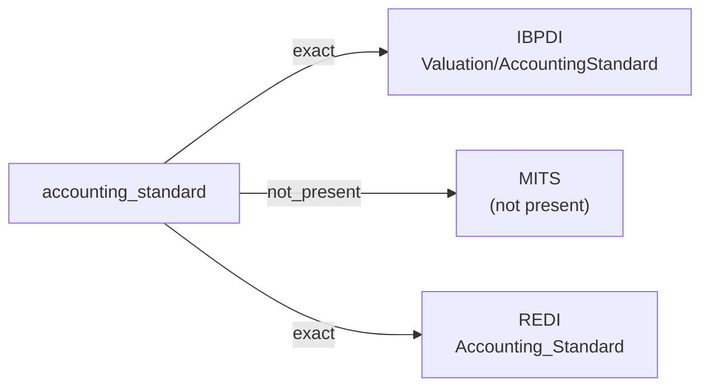

# accounting_standard

The accounting framework used to prepare an entity's financial statements — for example IFRS, IFRS-EU, US GAAP, Luxembourg GAAP, or another national framework. Free-form text or controlled vocabulary depending on the source.

**Aliases:** `gaap`, `reporting_standard`, `accounting_framework`

**Maintainer:** `@coradata/maintainers`  •  **Last reviewed:** 2026-06-07

## Mappings

| Standard | Field | Confidence | Definition | Inventory |
|---|---|---|---|---|
| IBPDI | `Valuation/AccountingStandard` | 🟢 exact | Name of Accounting standard used | [portfolio-and-asset-management](../inventories/ibpdi/portfolio-and-asset-management.md) |
| MITS | — | ⚪ not_present | MITS is leasing-and-operations flavored; accounting-framework attribution is out of scope. | — |
| REDI | `Accounting_Standard` | 🟢 exact | The accounting standards used to fill in the template for the underlying fund (e.g., Luxembourg GAAP, IFRS-EU, US GAAP). See below list for valid entries: -US GAAP -IFRS - EU -IFRS - Other -Dutch GAAP -French GAAP -German GAAP -Italian GAAP -Jersey GAAP -Luxembourg GAAP -UK GAAP -Other | [data-fields](../inventories/redi/data-fields.md) |

## Graph

_Generated by `cora docs build`. Do not edit by hand — regenerate when the underlying inventories or crosswalks change._
