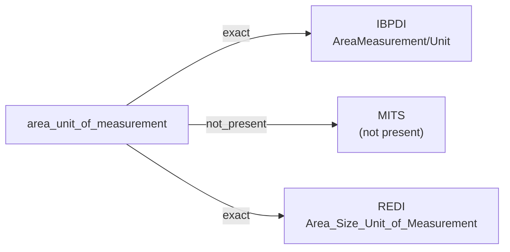

# area_unit_of_measurement

The unit in which an area or floor-size measurement is expressed — square feet, square metres, square yards, or another jurisdictional standard. Typically a controlled-vocabulary value the source defines.

**Aliases:** `area_unit`, `area_measurement_unit`, `floor_area_unit`

**Maintainer:** `@coradata/maintainers`  •  **Last reviewed:** 2026-06-08

## Mappings

| Standard | Field | Confidence | Definition | Inventory |
|---|---|---|---|---|
| IBPDI | `AreaMeasurement/Unit` | 🟢 exact | Unit area is measured with | [digital-twin](../inventories/ibpdi/digital-twin.md) |
| MITS | — | ⚪ not_present | MITS does not surface an explicit area-unit field; ``UnitType`` carries ``MinSquareFeet`` / ``MaxSquareFeet`` and ``SquareFootType`` with the unit (square feet) baked into the field names. The unit-of-measurement concept exists but is not separately addressable. | — |
| REDI | `Area_Size_Unit_of_Measurement` | 🟢 exact | The unit of measurement used to record the asset's area/ size. See below list for valid entries: -Square Foot -Square Meter | [data-fields](../inventories/redi/data-fields.md) |

## Graph

_Generated by `cora docs build`. Do not edit by hand — regenerate when the underlying inventories or crosswalks change._
