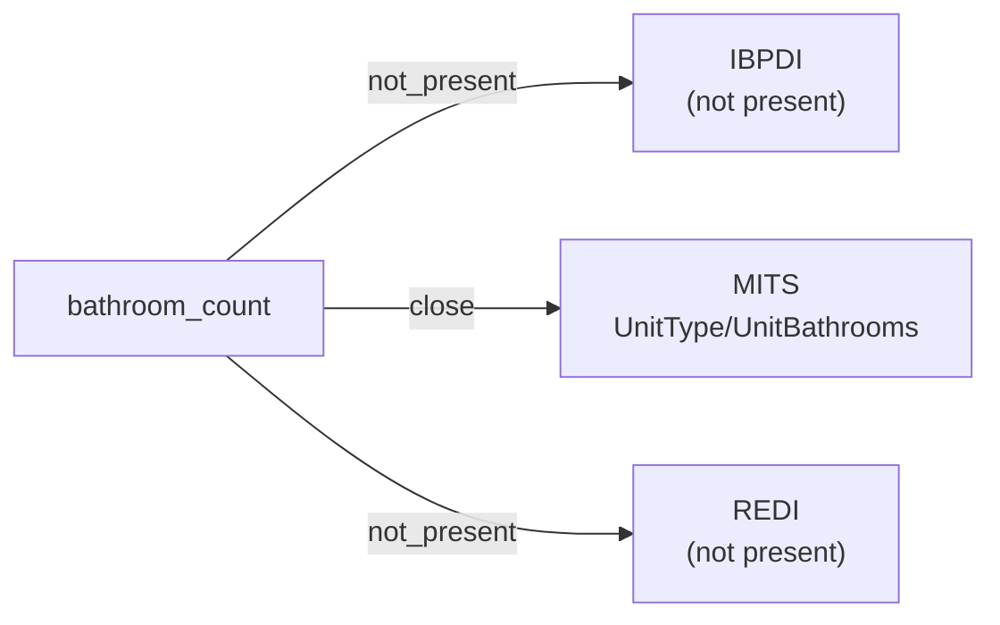

# bathroom_count

The number of bathrooms in a residential unit. May be fractional (e.g., "1.5" for a unit with one full and one half-bath).

**Aliases:** `bathrooms`, `bath_count`, `num_bathrooms`

**Maintainer:** `@coradata/maintainers`  •  **Last reviewed:** 2026-06-08

## Mappings

| Standard | Field | Confidence | Definition | Inventory |
|---|---|---|---|---|
| IBPDI | — | ⚪ not_present | Same posture as ``bedroom_count``. IBPDI's ``RentalUnit`` entity does not model residential unit attributes at the bedroom / bathroom level. | — |
| MITS | `UnitType/UnitBathrooms` | 🟢 close | MITS ``UnitType/UnitBathrooms`` carries the per-floor-plan bathroom count. Range is ``Decimal4Digits2Fraction``, allowing the standard half-bath convention (``1.5`` for one full + one half). Empty upstream definition; semantics inferred from the field name and the sibling ``UnitBedrooms``. Confidence ``close`` rather than ``exact`` because of the thin upstream documentation. | [accounts-payable](../inventories/mits/accounts-payable.md) |
| REDI | — | ⚪ not_present | REDI is fund-level investment reporting; per-unit residential attributes are out of scope. | — |

## Graph

_Generated by `cora docs build`. Do not edit by hand — regenerate when the underlying inventories or crosswalks change._
