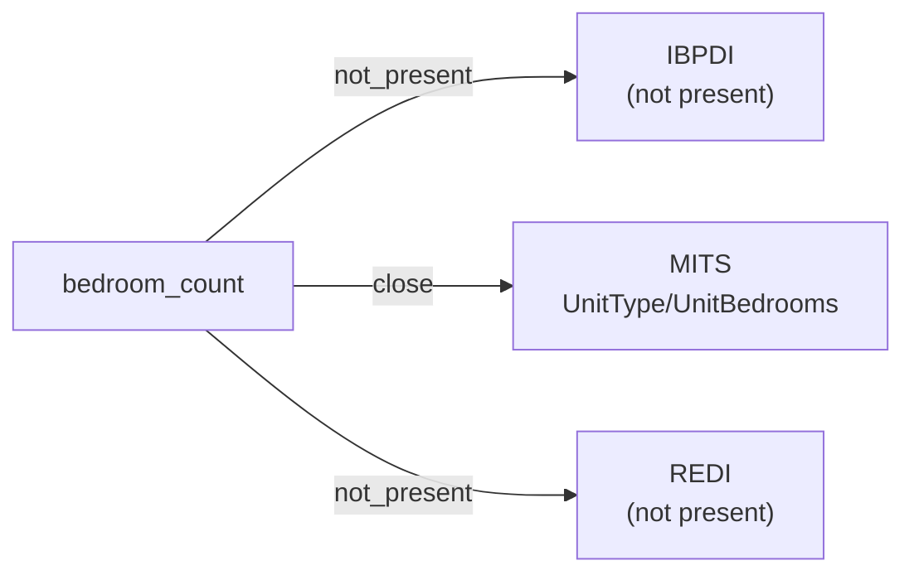

# bedroom_count

The number of bedrooms in a residential unit. May be fractional in some standards (e.g., "0" for a studio, "1.5" for a one-bedroom-plus-den).

**Aliases:** `bedrooms`, `bedroom_qty`, `num_bedrooms`

**Maintainer:** `@coradata/maintainers`  •  **Last reviewed:** 2026-06-08

## Mappings

| Standard | Field | Confidence | Definition | Inventory |
|---|---|---|---|---|
| IBPDI | — | ⚪ not_present | IBPDI's ``RentalUnit`` entity captures usage type and contract linkage but does not model residential unit attributes (bedroom count, bathroom count, etc.) at this granularity. IBPDI is commercial-and-residential agnostic; MITS is residential-flavored. | — |
| MITS | `UnitType/UnitBedrooms` | 🟢 close | MITS ``UnitType/UnitBedrooms`` carries the per-floor-plan bedroom count. Range is ``Decimal4Digits2Fraction`` (allowing fractional bedrooms such as 0 for a studio or 1.5 for a one-bedroom-plus-den). Empty upstream definition; semantics inferred from the field name and the sibling ``UnitBathrooms``. Confidence ``close`` rather than ``exact`` because of the thin upstream documentation. | [accounts-payable](../inventories/mits/accounts-payable.md) |
| REDI | — | ⚪ not_present | REDI is fund-level investment reporting; per-unit residential attributes are out of scope. | — |

## Graph

_Generated by `cora docs build`. Do not edit by hand — regenerate when the underlying inventories or crosswalks change._
