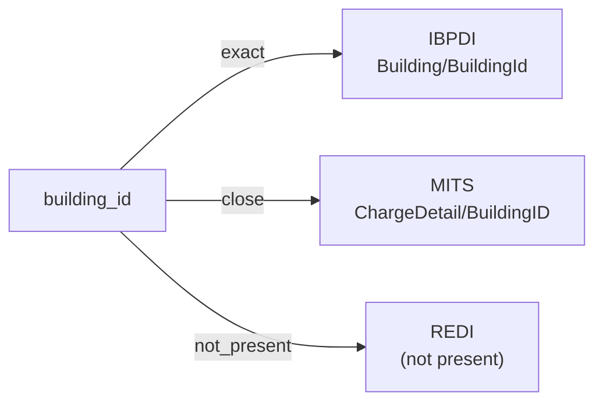

# building_id

The unique identifier of a physical building within a property, portfolio, or asset hierarchy — the primary key the source standard uses to refer to the building across modules and across systems. Typically a string assigned by the property-management or asset-management system of record.

**Aliases:** `building_identifier`, `structure_id`

**Maintainer:** `@coradata/maintainers`  •  **Last reviewed:** 2026-06-08

## Mappings

| Standard | Field | Confidence | Definition | Inventory |
|---|---|---|---|---|
| IBPDI | `Building/BuildingId` | 🟢 exact | Unique identifier either coming from previous system otherwise it needs to be defined | [digital-twin](../inventories/ibpdi/digital-twin.md) |
| MITS | `ChargeDetail/BuildingID` | 🟢 close | Left for backwards compatibility to ver 2.0 and will be removed in future versions. SupplementalID should be used. | [resident-transactions](../inventories/mits/resident-transactions.md) |
| REDI | — | ⚪ not_present | REDI is fund-level investment reporting; per-building identifiers are out of scope. | — |

## Graph

_Generated by `cora docs build`. Do not edit by hand — regenerate when the underlying inventories or crosswalks change._
