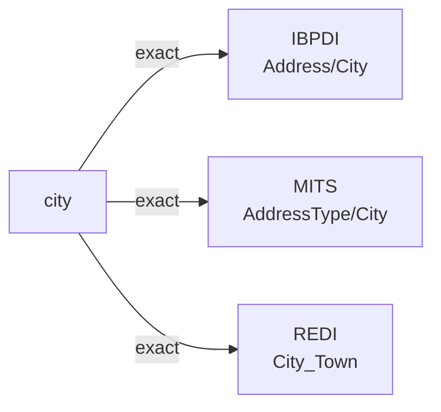

# city

The city, town, or municipality where a real-estate address is located. The governmental unit immediately above postal code in most jurisdictions; below state/province. Excludes neighborhood, county, and country.

**Aliases:** `town`, `municipality`, `locality`

**Maintainer:** `@coradata/maintainers`  •  **Last reviewed:** 2026-06-01

## Mappings

| Standard | Field | Confidence | Definition | Inventory |
|---|---|---|---|---|
| IBPDI | `Address/City` | 🟢 exact | Any official settlement including cities, towns, villages, hamlets, localities, etc. | [organisational-management](../inventories/ibpdi/organisational-management.md) |
| MITS | `AddressType/City` | 🟢 exact | City property is located in | [accounts-payable](../inventories/mits/accounts-payable.md) |
| REDI | `City_Town` | 🟢 exact | The city or town where the asset is located | [data-fields](../inventories/redi/data-fields.md) |

## Graph

_Generated by `cora docs build`. Do not edit by hand — regenerate when the underlying inventories or crosswalks change._
