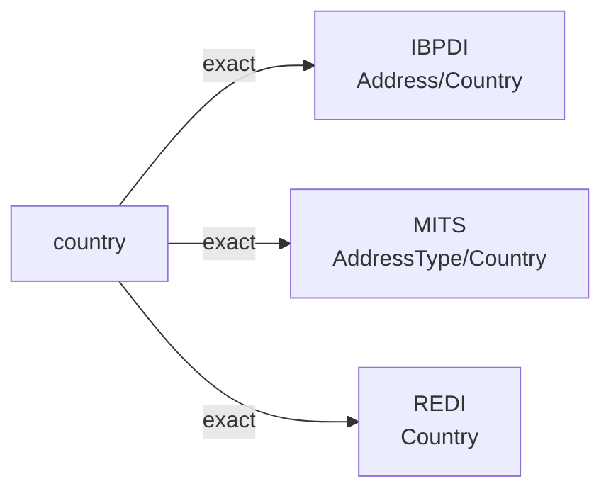

# country

The country where an entity — a property, asset, organization, or other modeled subject — is located or registered. The conventional machine representation is an ISO 3166-1 alpha-2 code (e.g., ``US``, ``GB``, ``DE``); some sources also accept the English name or an ISO 3166-1 alpha-3 code.

**Aliases:** `nation`, `country_code`, `iso_country`

**Maintainer:** `@coradata/maintainers`  •  **Last reviewed:** 2026-06-07

## Mappings

| Standard | Field | Confidence | Definition | Inventory |
|---|---|---|---|---|
| IBPDI | `Address/Country` | 🟢 exact | Sovereign nations and their dependent territories, anything with an ISO-3166 ALPHA-2 code | [organisational-management](../inventories/ibpdi/organisational-management.md) |
| MITS | `AddressType/Country` | 🟢 exact | Country property is located in | [accounts-payable](../inventories/mits/accounts-payable.md) |
| REDI | `Country` | 🟢 exact | The country where the asset is located | [data-fields](../inventories/redi/data-fields.md) |

## Graph

_Generated by `cora docs build`. Do not edit by hand — regenerate when the underlying inventories or crosswalks change._
