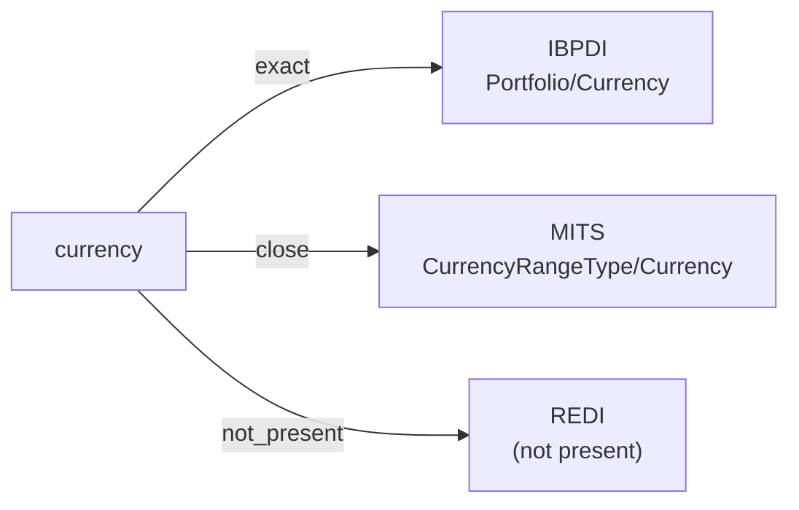

# currency

The currency in which a monetary value or financial obligation is denominated. The conventional machine representation is an ISO 4217 three-letter code (e.g., ``USD``, ``EUR``, ``GBP``); some sources accept the currency name as free text.

**Aliases:** `currency_code`, `iso_currency`

**Maintainer:** `@coradata/maintainers`  •  **Last reviewed:** 2026-06-07

## Mappings

| Standard | Field | Confidence | Definition | Inventory |
|---|---|---|---|---|
| IBPDI | `Portfolio/Currency` | 🟢 exact | Main/default currency of portfolio (depending on user it should be able to change this) | [portfolio-and-asset-management](../inventories/ibpdi/portfolio-and-asset-management.md) |
| MITS | `CurrencyRangeType/Currency` | 🟢 close | MITS scopes ``Currency`` to ``CurrencyRangeType`` — a range-bounded monetary value type used in rental rates and pricing — rather than as a free-standing attribute. Same currency concept, narrower modeling scope; ``close`` rather than ``exact``. | [accounts-payable](../inventories/mits/accounts-payable.md) |
| REDI | — | ⚪ not_present | REDI carries monetary values but does not surface an explicit currency leaf; the reporting currency is implicit in the fund's reporting context. | — |

## Graph

_Generated by `cora docs build`. Do not edit by hand — regenerate when the underlying inventories or crosswalks change._
