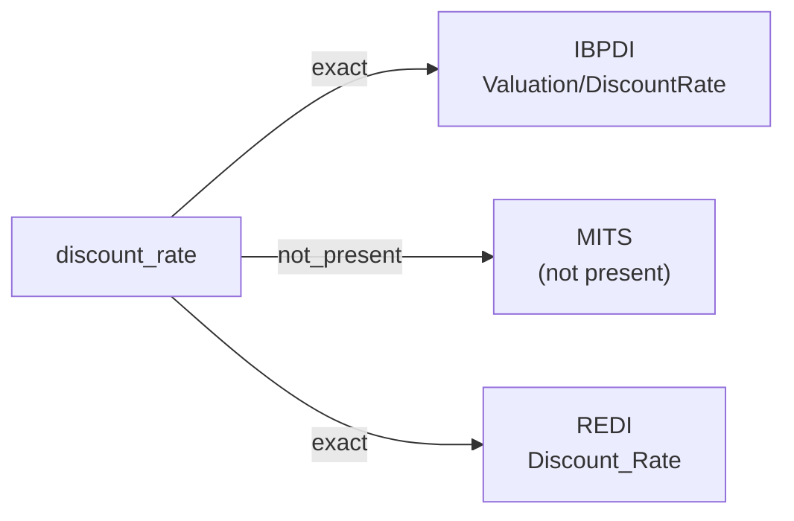

# discount_rate

The rate used to discount future cash flows to a present value during valuation — the cost of capital or required rate of return applied to an asset's projected cash flow series in DCF or fair-value modeling. Expressed as a percentage.

**Aliases:** `dcf_discount_rate`, `cost_of_capital`

**Maintainer:** `@coradata/maintainers`  •  **Last reviewed:** 2026-06-07

## Mappings

| Standard | Field | Confidence | Definition | Inventory |
|---|---|---|---|---|
| IBPDI | `Valuation/DiscountRate` | 🟢 exact | Discount rate included | [portfolio-and-asset-management](../inventories/ibpdi/portfolio-and-asset-management.md) |
| MITS | — | ⚪ not_present | MITS is leasing-and-operations flavored; valuation cash-flow modeling is out of scope. No discount-rate concept surfaces in the MITS XSDs. | — |
| REDI | `Discount_Rate` | 🟢 exact | The rate used to discount all cash flows to calculate the gross market value (fair value) for the asset | [data-fields](../inventories/redi/data-fields.md) |

## Graph

_Generated by `cora docs build`. Do not edit by hand — regenerate when the underlying inventories or crosswalks change._
