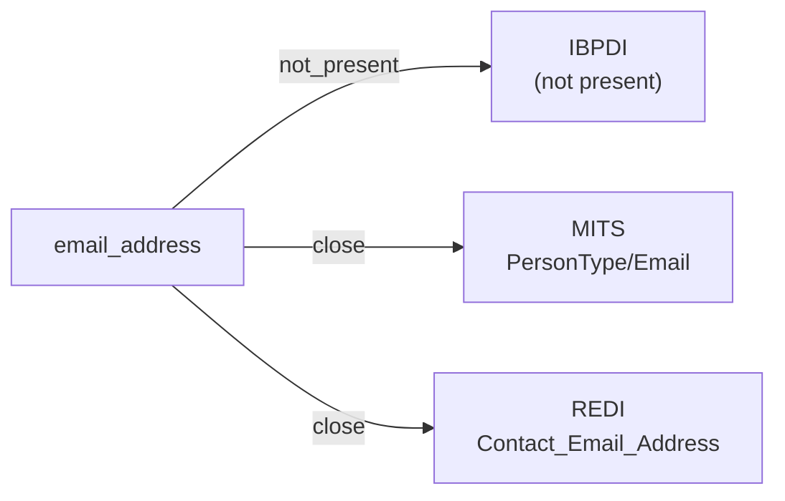

# email_address

An RFC 5321 / RFC 5322 electronic mail address (local-part @ domain) used to reach a person, organization, or role. Does not constrain ownership semantics (personal vs. shared vs. role inbox).

**Aliases:** `email`, `e_mail`, `mail_address`

**Maintainer:** `@coradata/maintainers`  •  **Last reviewed:** 2026-06-01

## Mappings

| Standard | Field | Confidence | Definition | Inventory |
|---|---|---|---|---|
| IBPDI | — | ⚪ not_present | IBPDI's organisational-management cluster carries ``Contact`` with first / last name but no email attribute in v1.0. Contact reachability is left to systems integrating IBPDI rather than modelled in the standard. | — |
| MITS | `PersonType/Email` | 🟢 close | MITS carries ``Email`` as a string field on ``PersonType``, ``CompanyType``, ``PropertyType``, and others. Mapped to ``PersonType`` as the prototypical person-bound case; the same crosswalk applies to the other domains. | [accounts-payable](../inventories/mits/accounts-payable.md) |
| REDI | `Contact_Email_Address` | 🟢 close | The email address associated with the listed contact | [data-fields](../inventories/redi/data-fields.md) |

## Graph

_Generated by `cora docs build`. Do not edit by hand — regenerate when the underlying inventories or crosswalks change._
