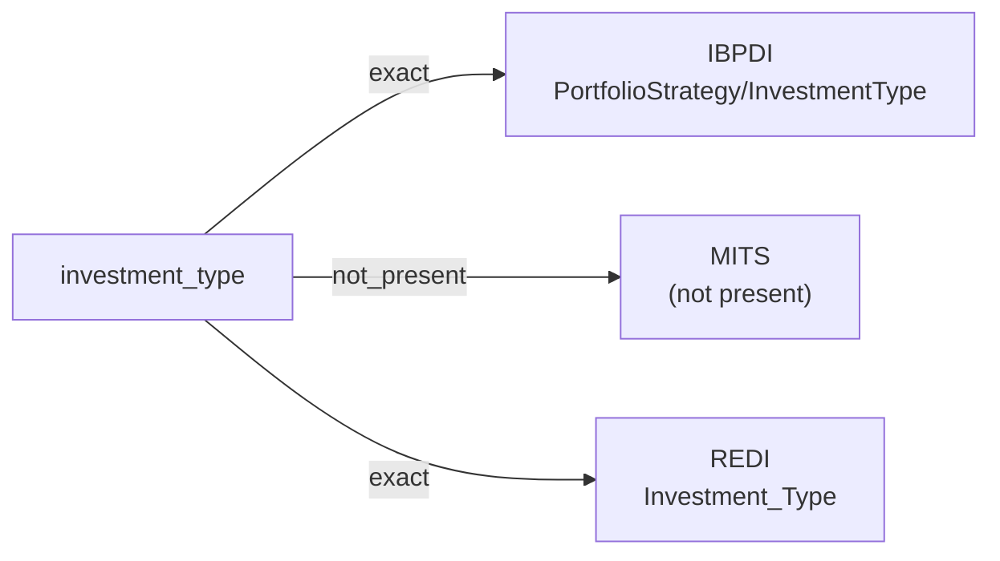

# investment_type

The category of investment strategy a fund or portfolio pursues — typically a controlled-vocabulary value such as core, value-add, opportunistic, debt, equity, or another classification the source defines.

**Aliases:** `strategy_type`, `investment_strategy`

**Maintainer:** `@coradata/maintainers`  •  **Last reviewed:** 2026-06-07

## Mappings

| Standard | Field | Confidence | Definition | Inventory |
|---|---|---|---|---|
| IBPDI | `PortfolioStrategy/InvestmentType` | 🟢 exact | Type of Strategy | [portfolio-and-asset-management](../inventories/ibpdi/portfolio-and-asset-management.md) |
| MITS | — | ⚪ not_present | MITS is leasing-and-operations flavored; investment-strategy categorization is out of scope. | — |
| REDI | `Investment_Type` | 🟢 exact | The predominant investable investment type for the fund (greater than 50% of the fund's gross assets), as described in the fund's agreements/ documentation. Select "Multiple" if no dominant classification exists. See below list for valid entries: -Private Equity -Private Debt -Public Equity -Public Debt -Multiple | [data-fields](../inventories/redi/data-fields.md) |

## Graph

_Generated by `cora docs build`. Do not edit by hand — regenerate when the underlying inventories or crosswalks change._
