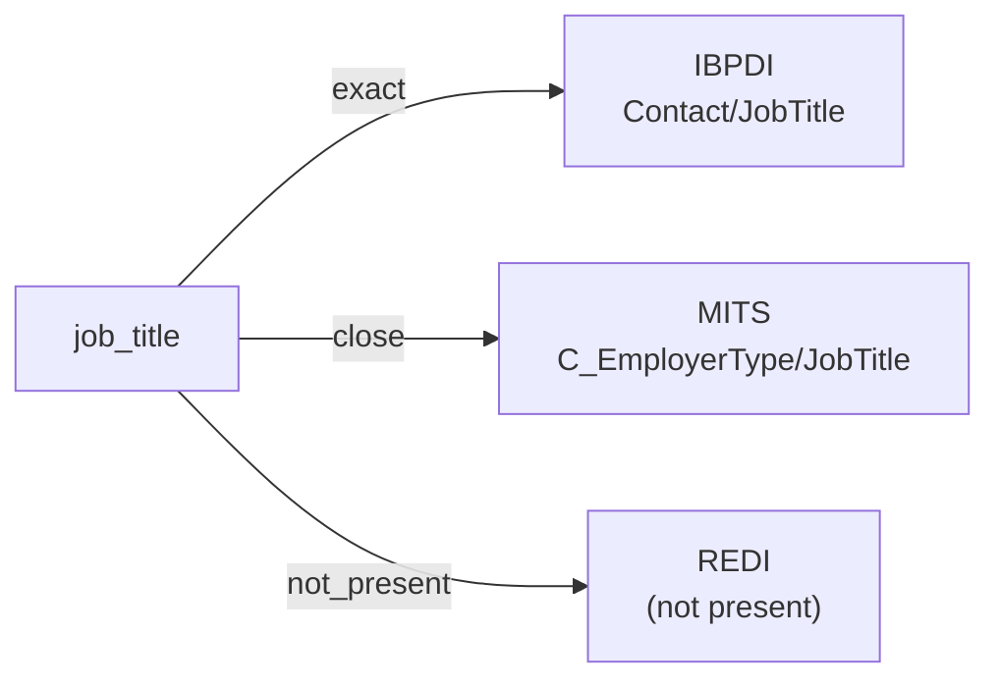

# job_title

The professional role or position a person holds with an employer, organization, or other affiliated entity. Free-form text rather than a controlled vocabulary; used to address the person correctly and to record occupational context.

**Aliases:** `occupation`, `position`, `role`

**Maintainer:** `@coradata/maintainers`  •  **Last reviewed:** 2026-06-07

## Mappings

| Standard | Field | Confidence | Definition | Inventory |
|---|---|---|---|---|
| IBPDI | `Contact/JobTitle` | 🟢 exact | Job title of the contact to make sure the contact is addressed correctly in sales calls, email, and marketing campaigns | [organisational-management](../inventories/ibpdi/organisational-management.md) |
| MITS | `C_EmployerType/JobTitle` | 🟢 close | MITS scopes ``JobTitle`` to ``C_EmployerType`` — the applicant's employer-context job title within the collections / resident-screening flow — rather than as a general contact attribute. Same concept, narrower modeling scope; ``close`` rather than ``exact``. | [collections](../inventories/mits/collections.md) |
| REDI | — | ⚪ not_present | REDI tracks contacts only at the organization / role level (e.g., ``Contact_Email_Address``). It does not carry a per-person job title field. | — |

## Graph

_Generated by `cora docs build`. Do not edit by hand — regenerate when the underlying inventories or crosswalks change._
