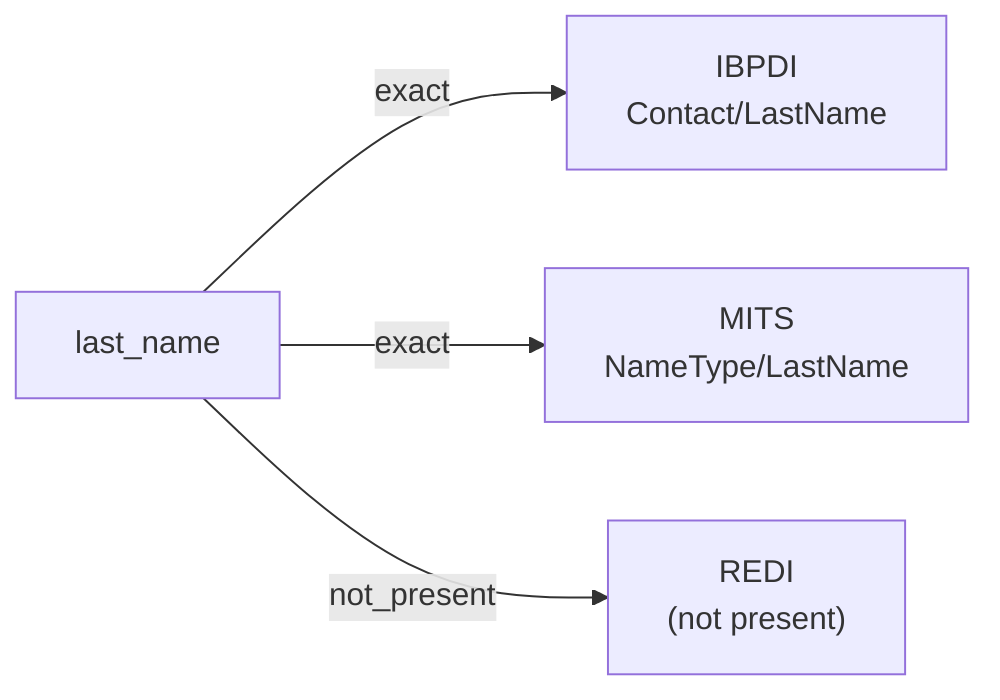

# last_name

The family name (surname) of a person — the name component conventionally following the given name in Western naming order. Excludes prefixes (Mr., Dr.), middle names, first names, and suffixes (Jr., III).

**Aliases:** `surname`, `family_name`

**Maintainer:** `@coradata/maintainers`  •  **Last reviewed:** 2026-06-07

## Mappings

| Standard | Field | Confidence | Definition | Inventory |
|---|---|---|---|---|
| IBPDI | `Contact/LastName` | 🟢 exact | Surname of Business Partner or responsible contact person | [organisational-management](../inventories/ibpdi/organisational-management.md) |
| MITS | `NameType/LastName` | 🟢 exact |  | [accounts-payable](../inventories/mits/accounts-payable.md) |
| REDI | — | ⚪ not_present | REDI is LP-investment-reporting flavored and tracks contacts only at the organization / role level (e.g., ``Contact_Email_Address``). It does not decompose contact names into first / last components. | — |

## Graph

_Generated by `cora docs build`. Do not edit by hand — regenerate when the underlying inventories or crosswalks change._
