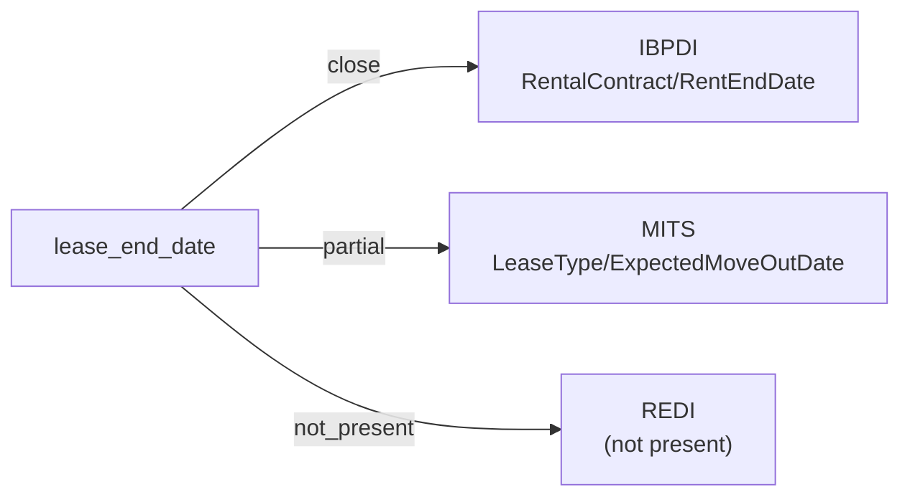

# lease_end_date

The date on which a lease or rental contract terminates. Distinct from the start date and from any actual move-out date (which may differ from the contractually agreed end).

**Aliases:** `lease_expiration_date`, `rent_end_date`, `tenancy_end`, `contract_end_date`

**Maintainer:** `@coradata/maintainers`  •  **Last reviewed:** 2026-06-01

## Mappings

| Standard | Field | Confidence | Definition | Inventory |
|---|---|---|---|---|
| IBPDI | `RentalContract/RentEndDate` | 🟢 close | Date original contract ends in yyyy-mm-ddThh:mm:ssZ form (conform to ISO 8061) | [property-management](../inventories/ibpdi/property-management.md) |
| MITS | `LeaseType/ExpectedMoveOutDate` | 🟡 partial | MITS distinguishes ``ExpectedMoveOutDate`` (contractual / planned) from ``ActualMoveOut`` (observed). The crosswalk targets the contractual end — consumers wanting move-out-as-observed should reference ``ActualMoveOut``. Confidence ``partial`` reflects this contractual-vs-observed ambiguity. | [accounts-payable](../inventories/mits/accounts-payable.md) |
| REDI | — | ⚪ not_present | REDI is LP-investment-reporting flavored and aggregates lease activity (e.g., ``Contract_Rent_Qtr``) rather than tracking per-lease term dates. Individual lease end dates fall outside REDI's reporting unit. | — |

## Graph

_Generated by `cora docs build`. Do not edit by hand — regenerate when the underlying inventories or crosswalks change._
