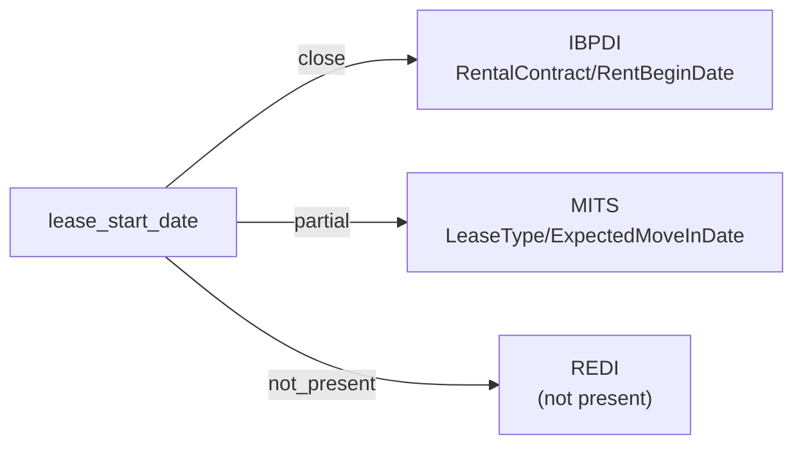

# lease_start_date

The date on which a lease or rental contract becomes effective. Distinct from the end date and from any actual move-in date (which may differ from the contractually agreed start).

**Aliases:** `lease_commencement_date`, `rent_begin_date`, `rent_start_date`, `tenancy_start`, `contract_start_date`

**Maintainer:** `@coradata/maintainers`  •  **Last reviewed:** 2026-06-08

## Mappings

| Standard | Field | Confidence | Definition | Inventory |
|---|---|---|---|---|
| IBPDI | `RentalContract/RentBeginDate` | 🟢 close | Date original contract starts in yyyy-mm-ddThh:mm:ssZ form (conform to ISO 8061) | [property-management](../inventories/ibpdi/property-management.md) |
| MITS | `LeaseType/ExpectedMoveInDate` | 🟡 partial | MITS distinguishes ``ExpectedMoveInDate`` (contractual / planned) from ``ActualMoveIn`` (observed occupancy). The crosswalk targets the contractual start — consumers wanting move-in-as-observed should reference ``ActualMoveIn`` (also surfaced as the dedicated ``move_in_date`` crosswalk). Confidence ``partial`` reflects this contractual-vs-observed ambiguity; same shape as ``lease_end_date``. | [accounts-payable](../inventories/mits/accounts-payable.md) |
| REDI | — | ⚪ not_present | REDI is LP-investment-reporting flavored and aggregates lease activity rather than tracking per-lease term dates. Individual lease start dates fall outside REDI's reporting unit. Same posture as ``lease_end_date``. | — |

## Graph

_Generated by `cora docs build`. Do not edit by hand — regenerate when the underlying inventories or crosswalks change._
