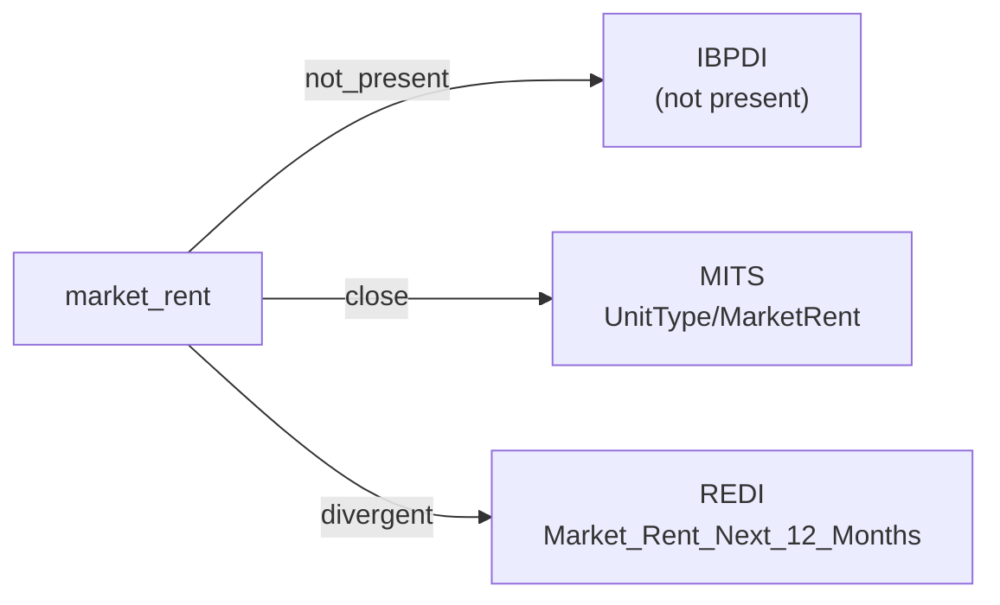

# market_rent

The market / asking rent for a unit or space — what a comparable unit would lease for at current market terms. Distinct from the contracted rent under any existing lease (see ``rent_amount``).

**Aliases:** `asking_rent`, `market_asking_rent`, `street_rent`

**Maintainer:** `@coradata/maintainers`  •  **Last reviewed:** 2026-06-08

## Mappings

| Standard | Field | Confidence | Definition | Inventory |
|---|---|---|---|---|
| IBPDI | — | ⚪ not_present | IBPDI's rental model surfaces the contracted payment (``RentalPayment.ValueMonth``) but does not separately track an asking / market rent for the unit. Consumers needing market-vs- contract comparison will find no IBPDI counterpart. | — |
| MITS | `UnitType/MarketRent` | 🟢 close | MITS ``UnitType/MarketRent`` is the asking / market rent on a unit; contrasted with ``UnitType/UnitRent`` (the actual contracted rent, mapped under ``rent_amount``). The field appears identically across all seven MITS modules. Confidence ``close`` rather than ``exact`` because the upstream definition string is empty; semantics inferred from the field name and the sibling ``UnitRent``. | [accounts-payable](../inventories/mits/accounts-payable.md) |
| REDI | `Market_Rent_Next_12_Months` | 🔴 divergent | The total market rent under existing leases for year one of the DCF analysis (only total annual amounts should be provided - do not reduce the time period nor provide adjusted amounts) | [data-fields](../inventories/redi/data-fields.md) |

## Graph

_Generated by `cora docs build`. Do not edit by hand — regenerate when the underlying inventories or crosswalks change._
