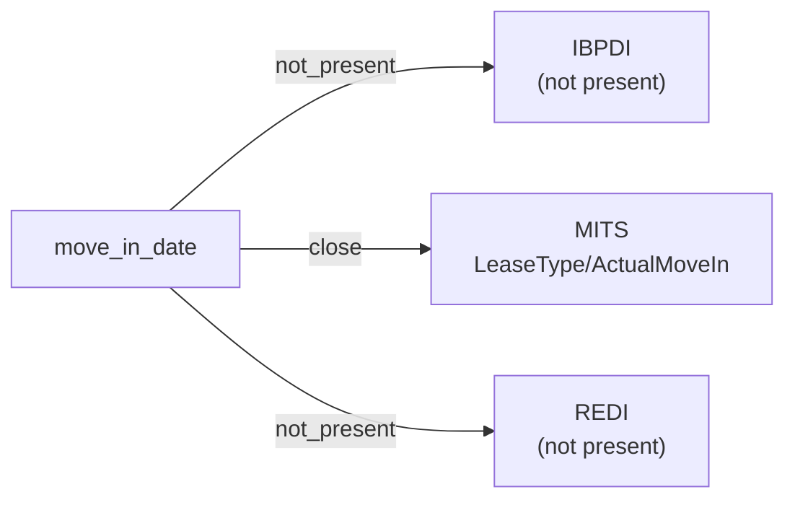

# move_in_date

The date on which a resident or tenant actually took occupancy of a leased unit or space. Distinct from the contractual lease start date, which may precede or follow the observed move-in.

**Aliases:** `actual_move_in`, `occupancy_start_date`, `take_possession_date`

**Maintainer:** `@coradata/maintainers`  •  **Last reviewed:** 2026-06-08

## Mappings

| Standard | Field | Confidence | Definition | Inventory |
|---|---|---|---|---|
| IBPDI | — | ⚪ not_present | IBPDI models the rental contract (``RentalContract.RentBeginDate``) but does not surface an observed move-in event. Consumers needing occupancy-as-observed semantics will find no IBPDI counterpart. | — |
| MITS | `LeaseType/ActualMoveIn` | 🟢 close | MITS ``LeaseType/ActualMoveIn`` is the observed occupancy event, contrasted with ``ExpectedMoveInDate`` (the contractual start, mapped under ``lease_start_date``). MITS Collections additionally exposes ``C_LeaseFileType/MoveInDate`` for collections-context records; ``LeaseType/ActualMoveIn`` is the canonical leasing-side path. | [accounts-payable](../inventories/mits/accounts-payable.md) |
| REDI | — | ⚪ not_present | REDI is LP-investment-reporting flavored and aggregates lease activity at the fund / quarter grain. Per-tenant occupancy events are out of scope. | — |

## Graph

_Generated by `cora docs build`. Do not edit by hand — regenerate when the underlying inventories or crosswalks change._
