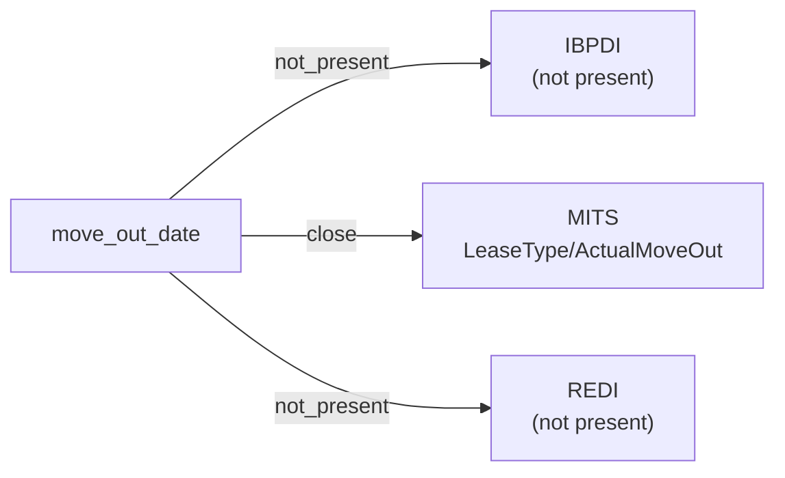

# move_out_date

The date on which a resident or tenant actually vacated a leased unit or space. Distinct from the contractual lease end date, which may precede or follow the observed move-out.

**Aliases:** `actual_move_out`, `occupancy_end_date`, `vacate_date`

**Maintainer:** `@coradata/maintainers`  •  **Last reviewed:** 2026-06-08

## Mappings

| Standard | Field | Confidence | Definition | Inventory |
|---|---|---|---|---|
| IBPDI | — | ⚪ not_present | IBPDI models the rental contract (``RentalContract.RentEndDate``) but does not surface an observed move-out event. Consumers needing occupancy-as-observed semantics will find no IBPDI counterpart. | — |
| MITS | `LeaseType/ActualMoveOut` | 🟢 close | MITS ``LeaseType/ActualMoveOut`` is the observed vacate event, contrasted with ``ExpectedMoveOutDate`` (the contractual end, mapped under ``lease_end_date``). MITS Collections additionally exposes ``C_LeaseFileType/MoveOutDate`` for collections-context records; ``LeaseType/ActualMoveOut`` is the canonical leasing-side path. | [accounts-payable](../inventories/mits/accounts-payable.md) |
| REDI | — | ⚪ not_present | REDI is LP-investment-reporting flavored and aggregates lease activity at the fund / quarter grain. Per-tenant vacate events are out of scope. | — |

## Graph

_Generated by `cora docs build`. Do not edit by hand — regenerate when the underlying inventories or crosswalks change._
