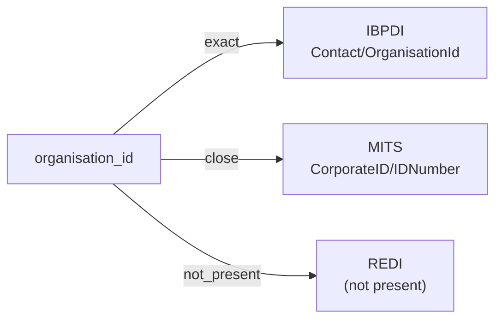

# organisation_id

The unique identifier of an organisation — a company, fund manager, service provider, vendor, or other institutional entity referenced by other records in the corpus. The identifier is typically a string assigned by the system of record and used as a foreign key from contacts, properties, contracts, and related entities.

**Aliases:** `organization_id`, `org_id`, `corporate_id`, `company_id`

**Maintainer:** `@coradata/maintainers`  •  **Last reviewed:** 2026-06-08

## Mappings

| Standard | Field | Confidence | Definition | Inventory |
|---|---|---|---|---|
| IBPDI | `Contact/OrganisationId` | 🟢 exact | IBPDI exposes ``OrganisationId`` as a foreign key on ~19 entities (Contact, plus every ``Role*Organisation`` relationship aggregate — ``RoleBuildingOrganisation``, ``RolePortfolioOrganisation``, etc.). All reference the same canonical ``Organisation`` entity. The path shown here is one canonical example; the crosswalk-paths validator resolves any of them. | [organisational-management](../inventories/ibpdi/organisational-management.md) |
| MITS | `CorporateID/IDNumber` | 🟢 close | MITS scopes the organisation-identifier concept to corporate-tenant modeling: ``CorporateID`` is a sibling type carrying ``IDNumber`` (the actual identifier string) plus ``IDIssuer`` (the authority that issued it). Same logical concept as IBPDI's ``OrganisationId`` but narrower domain — ``corporate tenant`` rather than ``any organisation`` — and richer surrounding metadata. ``close`` rather than ``exact``. | [lease-application](../inventories/mits/lease-application.md) |
| REDI | — | ⚪ not_present | REDI tracks organisations only by name as free-text strings (``Fund_Sponsor_Parent_Company``, ``Portfolio_Manager``, ``Deputy_Portfolio_Manager``). No explicit identifier field; the organisation-id concept is not modeled. | — |

## Graph

_Generated by `cora docs build`. Do not edit by hand — regenerate when the underlying inventories or crosswalks change._
