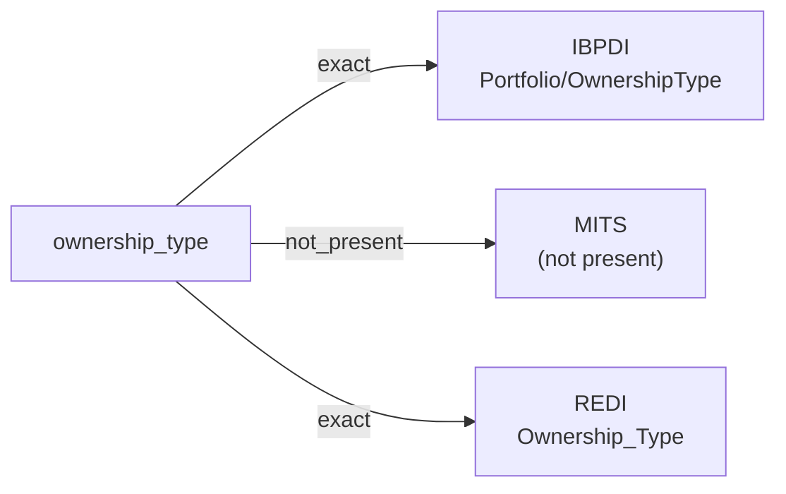

# ownership_type

The legal ownership structure of an asset, portfolio, or holding — typically freehold, leasehold, joint venture, fund-of-funds, or another category from a controlled vocabulary the source defines.

**Aliases:** `tenure`, `ownership_structure`

**Maintainer:** `@coradata/maintainers`  •  **Last reviewed:** 2026-06-07

## Mappings

| Standard | Field | Confidence | Definition | Inventory |
|---|---|---|---|---|
| IBPDI | `Portfolio/OwnershipType` | 🟢 exact | Describes the ownership structure of the portfolio | [portfolio-and-asset-management](../inventories/ibpdi/portfolio-and-asset-management.md) |
| MITS | — | ⚪ not_present | MITS models occupancy and leasing, not ownership structure. The property owner's identity surfaces (e.g., ``CompanyType``), but the ownership-type categorization does not. | — |
| REDI | `Ownership_Type` | 🟢 exact | The ownership type of the asset. If part of the asset is leasehold and part is freehold, it should be defined based on majority the share of market rent (MR). See below list for valid entries: -Freehold -Leasehold | [data-fields](../inventories/redi/data-fields.md) |

## Graph

_Generated by `cora docs build`. Do not edit by hand — regenerate when the underlying inventories or crosswalks change._
