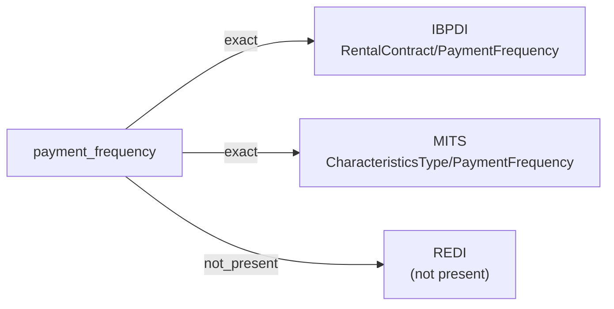

# payment_frequency

The cadence at which a recurring payment obligation falls due — weekly, bi-weekly, monthly, quarterly, semi-annually, annually, or another value from a controlled vocabulary the source defines.

**Aliases:** `billing_frequency`, `rent_frequency`, `payment_schedule`

**Maintainer:** `@coradata/maintainers`  •  **Last reviewed:** 2026-06-07

## Mappings

| Standard | Field | Confidence | Definition | Inventory |
|---|---|---|---|---|
| IBPDI | `RentalContract/PaymentFrequency` | 🟢 exact | Frequency of payment e.g. weekly, monthly, quarterly etc. | [property-management](../inventories/ibpdi/property-management.md) |
| MITS | `CharacteristicsType/PaymentFrequency` | 🟢 exact | The frequency on which the amounts specified in this item will be payable. | [property-marketing](../inventories/mits/property-marketing.md) |
| REDI | — | ⚪ not_present | REDI aggregates fund-level rent and cash-flow metrics on a quarterly or annual reporting cadence; it does not carry a per-contract payment-frequency attribute. | — |

## Graph

_Generated by `cora docs build`. Do not edit by hand — regenerate when the underlying inventories or crosswalks change._
