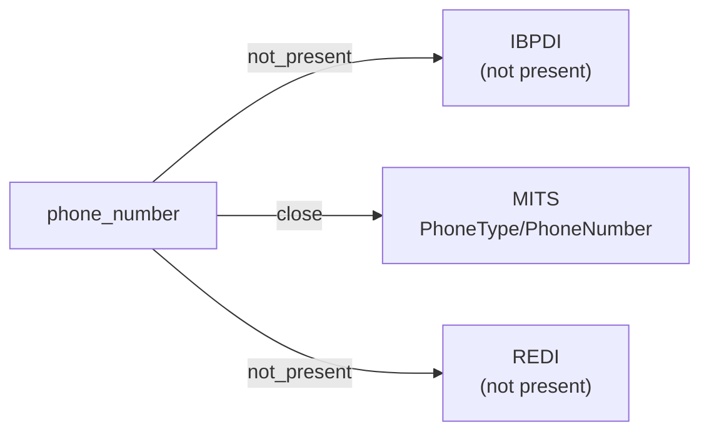

# phone_number

A telephone number used to reach a person, company, or property — a digit string typically formatted per ITU-T E.164 or a national convention. Does not constrain ownership semantics (personal vs shared vs role-based).

**Aliases:** `phone`, `telephone`, `tel`, `contact_number`

**Maintainer:** `@coradata/maintainers`  •  **Last reviewed:** 2026-06-08

## Mappings

| Standard | Field | Confidence | Definition | Inventory |
|---|---|---|---|---|
| IBPDI | — | ⚪ not_present | IBPDI's ``Contact`` entity carries first / last name, job title, employee ID, salutation, and validity dates — but no phone number (and no email; see ``email_address`` for the matching gap). Contact reachability is left to systems integrating IBPDI rather than modelled in the standard. | — |
| MITS | `PhoneType/PhoneNumber` | 🟢 close | MITS models phone contact as a complex ``PhoneType`` carrying ``PhoneNumber`` (the digit string, ``StringMax20Type``), ``Extension``, ``PhoneType`` (mobile / work / etc.), and ``PhoneDescription``. The crosswalk pins ``PhoneType/PhoneNumber`` as the core value; consumers needing the extension or type classification should resolve the surrounding ``PhoneType`` complex type. The ``PhoneType`` complex appears on ``PersonType``, ``CompanyType``, and ``PropertyType``. | [accounts-payable](../inventories/mits/accounts-payable.md) |
| REDI | — | ⚪ not_present | REDI scopes contact info to ``Contact_Name`` + ``Contact_Email_Address`` (the latter mapped under ``email_address``) — no phone number field. Same posture as IBPDI: contact reachability outside the standard. | — |

## Graph

_Generated by `cora docs build`. Do not edit by hand — regenerate when the underlying inventories or crosswalks change._
