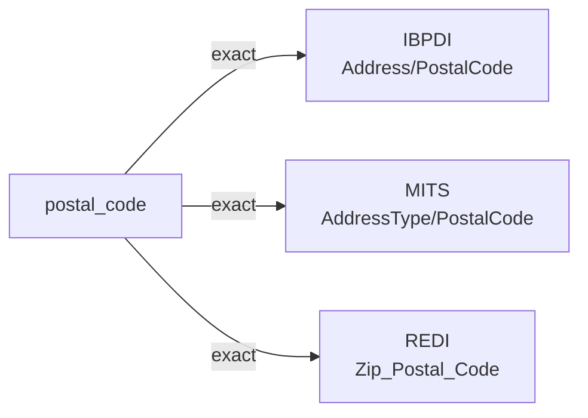

# postal_code

The postal sorting code used by the jurisdiction's postal service to route mail to its destination. US ZIP, Canadian postal code, UK postcode, and similar are all postal codes in this sense.

**Aliases:** `zip_code`, `zip`, `postcode`, `postal_zip`

**Maintainer:** `@coradata/maintainers`  •  **Last reviewed:** 2026-06-01

## Mappings

| Standard | Field | Confidence | Definition | Inventory |
|---|---|---|---|---|
| IBPDI | `Address/PostalCode` | 🟢 exact | Postal codes used for mail sorting | [organisational-management](../inventories/ibpdi/organisational-management.md) |
| MITS | `AddressType/PostalCode` | 🟢 exact | Property postal code | [accounts-payable](../inventories/mits/accounts-payable.md) |
| REDI | `Zip_Postal_Code` | 🟢 exact | The zip or postal code where the asset is located | [data-fields](../inventories/redi/data-fields.md) |

## Graph

_Generated by `cora docs build`. Do not edit by hand — regenerate when the underlying inventories or crosswalks change._
