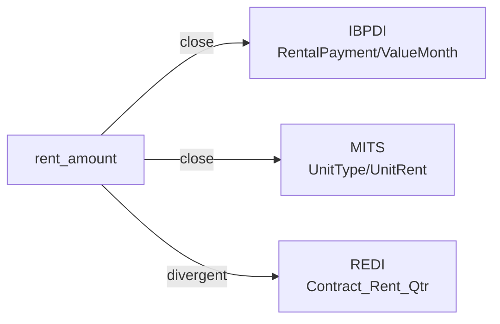

# rent_amount

The contracted rent payable by a tenant for a unit or space, expressed as a monetary amount. Distinct from the asking / marketed rent (see ``market_rent``).

**Aliases:** `monthly_rent`, `contract_rent`, `unit_rent`, `rental_value`

**Maintainer:** `@coradata/maintainers`  •  **Last reviewed:** 2026-06-08

## Mappings

| Standard | Field | Confidence | Definition | Inventory |
|---|---|---|---|---|
| IBPDI | `RentalPayment/ValueMonth` | 🟢 close | Value of payment per month | [property-management](../inventories/ibpdi/property-management.md) |
| MITS | `UnitType/UnitRent` | 🟢 close | MITS exposes ``UnitType/UnitRent`` (the contractual rent on the unit) alongside ``UnitType/MarketRent`` (asking / market rent — mapped under ``market_rent``). Range is ``Decimal7Digits2Fraction`` (a MITS-defined currency-precision type). MITS Collections additionally surfaces ``C_LeaseFileType/MonthlyRentAmount`` for collections records; the core-data ``UnitRent`` path is canonical. Confidence ``close`` rather than ``exact`` because the upstream definition string is empty; semantics inferred from the field name and the sibling ``MarketRent``. | [accounts-payable](../inventories/mits/accounts-payable.md) |
| REDI | `Contract_Rent_Qtr` | 🔴 divergent | The total contract rent under existing leases for the reporting period | [data-fields](../inventories/redi/data-fields.md) |

## Graph

_Generated by `cora docs build`. Do not edit by hand — regenerate when the underlying inventories or crosswalks change._
