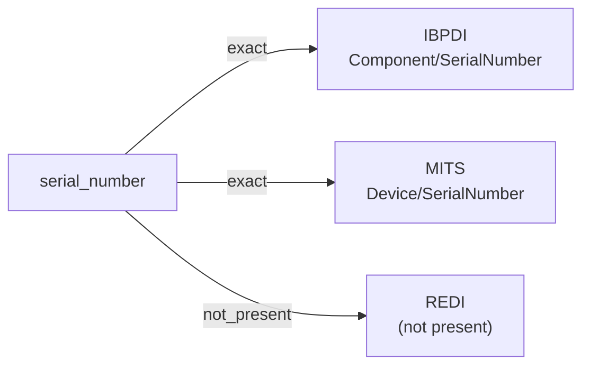

# serial_number

A unique identifier assigned by the manufacturer (or another authoritative party) to a single instance of a physical piece of equipment — building components, devices, fixtures, or other assets that need to be tracked individually for maintenance, warranty, or compliance.

**Aliases:** `manufacturer_serial`, `asset_serial`, `sn`

**Maintainer:** `@coradata/maintainers`  •  **Last reviewed:** 2026-06-07

## Mappings

| Standard | Field | Confidence | Definition | Inventory |
|---|---|---|---|---|
| IBPDI | `Component/SerialNumber` | 🟢 exact | Serial number of component | [digital-twin](../inventories/ibpdi/digital-twin.md) |
| MITS | `Device/SerialNumber` | 🟢 exact | MITS surfaces ``SerialNumber`` in two contexts: lease-application ``Device`` (e.g., access fobs, smart-home devices issued to a resident) and accounts-payable ``InvoiceDetailType``. The crosswalk targets the Device path as the canonical equipment-identifier modeling; both resolve to the same concept. | [lease-application](../inventories/mits/lease-application.md) |
| REDI | — | ⚪ not_present | REDI is fund-level investment reporting; individual-equipment identification is out of scope. | — |

## Graph

_Generated by `cora docs build`. Do not edit by hand — regenerate when the underlying inventories or crosswalks change._
