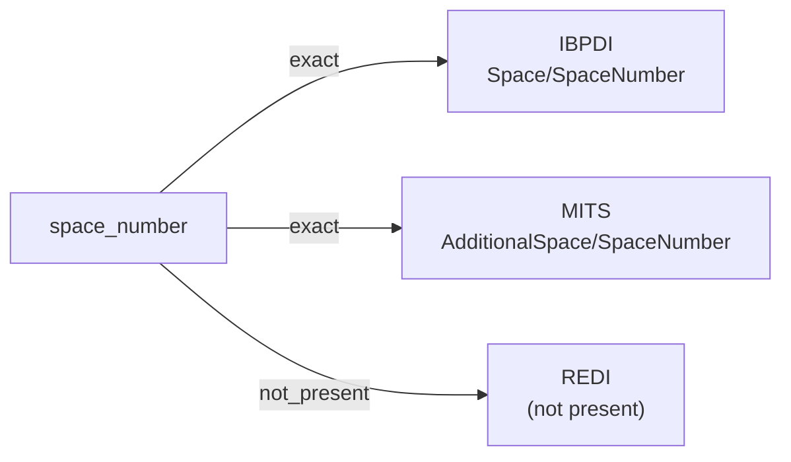

# space_number

An identifier for a discrete space within a building or property — a room, unit, parking space, storage space, or other addressable location. Often numeric or alphanumeric and unique within its containing aggregate.

**Aliases:** `space_id`, `room_number`

**Maintainer:** `@coradata/maintainers`  •  **Last reviewed:** 2026-06-07

## Mappings

| Standard | Field | Confidence | Definition | Inventory |
|---|---|---|---|---|
| IBPDI | `Space/SpaceNumber` | 🟢 exact | Number of space | [digital-twin](../inventories/ibpdi/digital-twin.md) |
| MITS | `AdditionalSpace/SpaceNumber` | 🟢 exact | MITS scopes ``SpaceNumber`` to ``AdditionalSpace`` — auxiliary spaces tied to a lease application (parking, storage, etc.) — distinct from the primary unit identifier. | [lease-application](../inventories/mits/lease-application.md) |
| REDI | — | ⚪ not_present | REDI is fund-level investment reporting; per-space identifiers are out of scope. | — |

## Graph

_Generated by `cora docs build`. Do not edit by hand — regenerate when the underlying inventories or crosswalks change._
