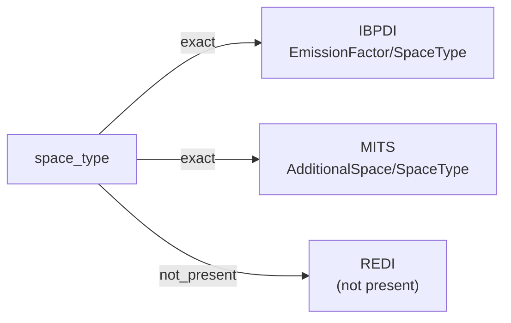

# space_type

The category or function of a discrete space within a building — office, retail, residential unit, common area, storage, parking, or another value from a controlled vocabulary the source defines. Used to organize spaces by use class for reporting, leasing, and operational purposes.

**Aliases:** `space_category`, `room_type`, `use_class`

**Maintainer:** `@coradata/maintainers`  •  **Last reviewed:** 2026-06-07

## Mappings

| Standard | Field | Confidence | Definition | Inventory |
|---|---|---|---|---|
| IBPDI | `EmissionFactor/SpaceType` | 🟢 exact | Differentiated emission factor for certain space type (within a building) | [energy-and-resources](../inventories/ibpdi/energy-and-resources.md) |
| MITS | `AdditionalSpace/SpaceType` | 🟢 exact | MITS scopes ``SpaceType`` to ``AdditionalSpace`` (parking, storage, etc.) at lease-application time. | [lease-application](../inventories/mits/lease-application.md) |
| REDI | — | ⚪ not_present | REDI is fund-level investment reporting; per-space categorization is out of scope. | — |

## Graph

_Generated by `cora docs build`. Do not edit by hand — regenerate when the underlying inventories or crosswalks change._
