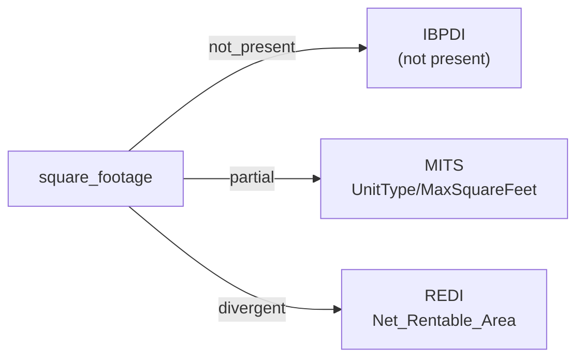

# square_footage

The physical area of a unit or rentable space, expressed as a numeric size. The companion unit-of-measurement concept (square feet, square metres, etc.) is mapped under ``area_unit_of_measurement``.

**Aliases:** `floor_area`, `rentable_area`, `unit_size`, `area_size`

**Maintainer:** `@coradata/maintainers`  •  **Last reviewed:** 2026-06-08

## Mappings

| Standard | Field | Confidence | Definition | Inventory |
|---|---|---|---|---|
| IBPDI | — | ⚪ not_present | IBPDI's ``AreaMeasurement`` entity carries methodology metadata (``Standard`` — BOMA / IPMS, ``Type``, ``Unit``, ``Accuracy``) and links the measurement to a building / floor / land / site / space / unit / rental-unit via the corresponding ``AreaMeasurement<Scope>`` join entities, but the committed inventory does not surface a numeric area value on this entity. Consumers integrating IBPDI area data with MITS / REDI will find the methodology metadata but not a usable numeric size from this inventory. | — |
| MITS | `UnitType/MaxSquareFeet` | 🟡 partial | MITS ``UnitType`` represents a floor-plan class (one record per floor plan, not per physical unit). Size is expressed as the range ``UnitType/MinSquareFeet`` … ``UnitType/MaxSquareFeet``, with ``UnitType/SquareFootType`` controlling whether to display the min, max, or both. The crosswalk pins the upper bound (``MaxSquareFeet``) as the canonical single field; consumers reconstructing a single "size" value should consult ``SquareFootType`` and pick accordingly. Confidence ``partial`` reflects the range-vs-scalar shape mismatch and the implicit unit (square feet, as called out in ``area_unit_of_measurement``). | [accounts-payable](../inventories/mits/accounts-payable.md) |
| REDI | `Net_Rentable_Area` | 🔴 divergent | The total square foot/ meter area that may be leased or rented to tenants (i.e., for which rent can be charged). For multi-building assets, use the total net rentable area across all buildings | [data-fields](../inventories/redi/data-fields.md) |

## Graph

_Generated by `cora docs build`. Do not edit by hand — regenerate when the underlying inventories or crosswalks change._
