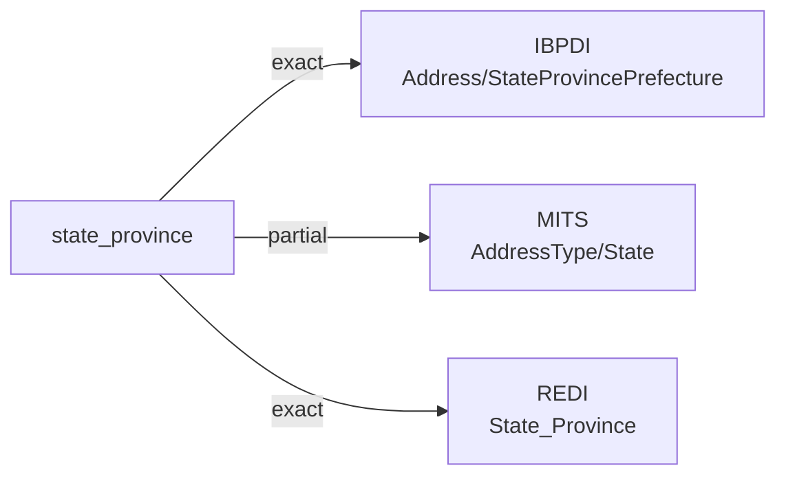

# state_province

The country's top-level administrative subdivision in which a property, address, or other modeled subject sits — a U.S. state, Canadian province, U.K. county, Japanese prefecture, German Land, or other jurisdiction- specific equivalent. The conventional machine representation is a jurisdiction-specific code (ISO 3166-2 in many cases) or a free-text name.

**Aliases:** `state`, `province`, `prefecture`, `subdivision`, `state_or_province`

**Maintainer:** `@coradata/maintainers`  •  **Last reviewed:** 2026-06-08

## Mappings

| Standard | Field | Confidence | Definition | Inventory |
|---|---|---|---|---|
| IBPDI | `Address/StateProvincePrefecture` | 🟢 exact | First-level administrative division, depending on the continent or country if might be named differently. | [organisational-management](../inventories/ibpdi/organisational-management.md) |
| MITS | `AddressType/State` | 🟡 partial | The State attribute describes the 2-3 character state code of the address, not the full state name. | [accounts-payable](../inventories/mits/accounts-payable.md) |
| REDI | `State_Province` | 🟢 exact | The state or province where the asset is located | [data-fields](../inventories/redi/data-fields.md) |

## Graph

_Generated by `cora docs build`. Do not edit by hand — regenerate when the underlying inventories or crosswalks change._
