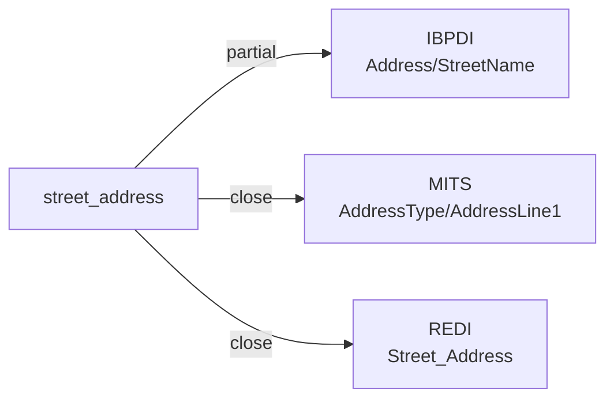

# street_address

The first line of a postal address — typically a street number and street name, PO box, or other primary delivery line. Excludes secondary descriptors (unit number, suite) which often appear on a second address line.

**Aliases:** `address_line_1`, `street`, `delivery_address_line_1`

**Maintainer:** `@coradata/maintainers`  •  **Last reviewed:** 2026-06-01

## Mappings

| Standard | Field | Confidence | Definition | Inventory |
|---|---|---|---|---|
| IBPDI | `Address/StreetName` | 🟡 partial | Name of the street | [organisational-management](../inventories/ibpdi/organisational-management.md) |
| MITS | `AddressType/AddressLine1` | 🟢 close | PO Box or Street number, direction, street name, suffix | [accounts-payable](../inventories/mits/accounts-payable.md) |
| REDI | `Street_Address` | 🟢 close | The full street address of the asset. If the asset spans multiple street addresses (e.g., an industrial park), enter the street address of the largest asset | [data-fields](../inventories/redi/data-fields.md) |

## Graph

_Generated by `cora docs build`. Do not edit by hand — regenerate when the underlying inventories or crosswalks change._
