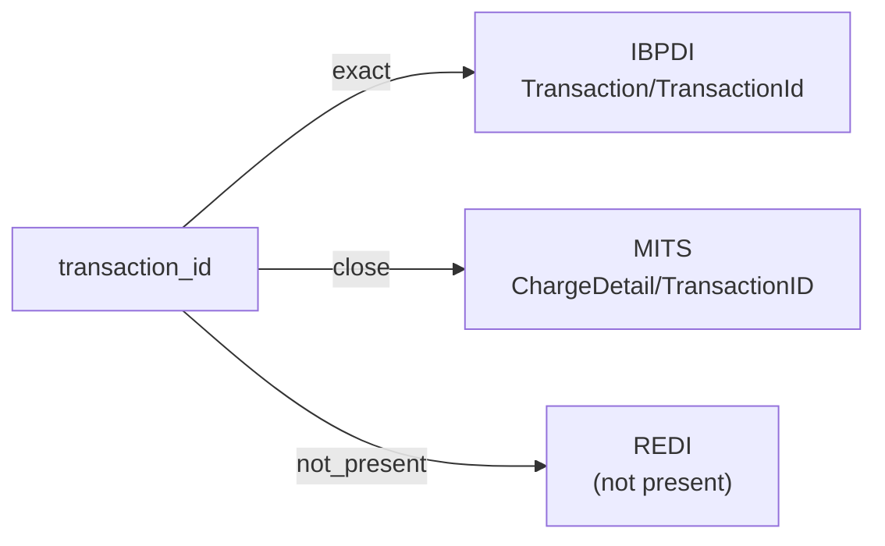

# transaction_id

A unique identifier for a single financial transaction record — a posting, charge, payment, or other booking. The identifier is opaque to consumers; ownership and namespace semantics are defined by the source system.

**Aliases:** `transaction_identifier`, `txn_id`, `posting_id`

**Maintainer:** `@coradata/maintainers`  •  **Last reviewed:** 2026-06-08

## Mappings

| Standard | Field | Confidence | Definition | Inventory |
|---|---|---|---|---|
| IBPDI | `Transaction/TransactionId` | 🟢 exact | Unique identifier either coming from previous system otherwise it needs to be defined | [financials](../inventories/ibpdi/financials.md) |
| MITS | `ChargeDetail/TransactionID` | 🟢 close | Specialized ID - Left as a string element. | [resident-transactions](../inventories/mits/resident-transactions.md) |
| REDI | — | ⚪ not_present | REDI is fund-level investment reporting; per-transaction identifiers are out of scope. Financial flows aggregate at the fund / quarter grain (e.g., ``Contract_Rent_Qtr``, ``Incentive_Fees_Paid_Qtr``) with no per-transaction record. | — |

## Graph

_Generated by `cora docs build`. Do not edit by hand — regenerate when the underlying inventories or crosswalks change._
