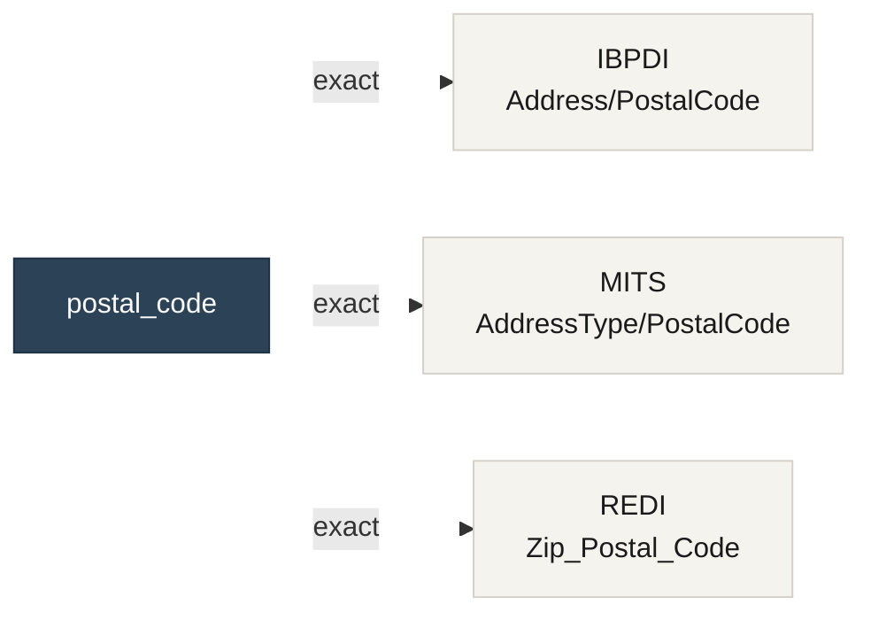

# Authoring a crosswalk

!!! note "Contributing"
    This page is the contributor walkthrough — the full pull-request flow from blank YAML to a merged crosswalk. If you just want CORA to add a concept your team needs, the lighter-weight path is [Requesting a crosswalk](requesting-a-crosswalk.md). Maintainers handle the YAML; you supply the field knowledge.

A walkthrough from blank `.yaml` to a committed concept crosswalk that passes the validator. Uses the `city` concept as the running example — already committed; you'd open a new file for a new concept.

## Step 1: Pick a concept

CORA crosswalks are **field-level** — each one maps a single canonical concept to one inventory field per standard (or declares the concept absent). Concepts that map cleanly are ones that exist as discrete leaf fields in multiple standards:

- Address parts (`street_address`, `city`, `postal_code`)
- Name parts (`first_name`, `last_name`)
- Identifiers (`property_id`, `unit_id`)
- Dates (`lease_start_date`, `lease_end_date`)
- Contact info (`email_address`, `phone_number`)

Type-level crosswalks (e.g. "the address concept") are out of scope for the current schema — they'd need a different shape. Stick to leaf-level.

## Step 2: Survey the inventories

Find which inventory field in each standard maps to your concept. Quick way: load every inventory, find fields whose path or definition matches a keyword:

```python
from pathlib import Path
from cora_extractors.inventory import Inventory

KEYWORDS = ["postal", "zip", "postcode"]
for yp in sorted(Path(".").glob("standards/*/current/inventory/*.yaml")):
    inv = Inventory.from_yaml(yp)
    for f in inv.fields:
        if any(k in f.path.lower() or k in (f.definition or "").lower() for k in KEYWORDS):
            print(f"{yp.parts[-4]}/{inv.module}: {f.path} ({f.cardinality})")
            break
```

Or use the [generated coverage matrix](https://github.com/coradata/cora/blob/main/docs/generated/coverage-matrix.md) to see which standards already have an `exact` mapping for related concepts.

## Step 3: Write the YAML

Start from the canonical shape:

```yaml
concept: postal_code
canonical_definition: >-
  The postal sorting code used by the jurisdiction's postal service to route
  mail to its destination. US ZIP, Canadian postal code, UK postcode, and
  similar are all postal codes in this sense.
aliases:
  - zip_code
  - zip
  - postcode
  - postal_zip
maintainer: '@coradata/maintainers'
last_reviewed: '2026-06-01'
mappings:
  mits:
    field: AddressType/PostalCode
    version: '4.0'
    confidence: exact
    source_url: https://github.com/coradata/cora/blob/main/standards/mits/current/inventory/property-marketing.yaml
  ibpdi:
    field: Address/PostalCode
    version: '1.0'
    confidence: exact
    source_url: https://github.com/coradata/cora/blob/main/standards/ibpdi/current/inventory/organisational-management.yaml
  redi:
    field: Zip_Postal_Code
    version: '1.0'
    confidence: exact
    source_url: https://github.com/coradata/cora/blob/main/standards/redi/current/inventory/data-fields.yaml
    notes: >-
      Field name combines US ZIP and international postal-code wording.
      Semantically identical to PostalCode.
```

### Required fields

- `concept` — lowercase snake_case identifier; same as the filename (`postal_code.yaml` → `concept: postal_code`).
- `canonical_definition` — your working definition. Minimum 10 characters.
- `maintainer` — GitHub handle or team (`@coradata/maintainers`).
- `last_reviewed` — ISO date.
- `mappings` — at least one `<std>` block.

### Per-standard mapping block

```yaml
mappings:
  <std>:
    field: <inventory path or null>
    version: <standard version>
    confidence: exact | close | partial | divergent | not_present
    source_url: <link to inventory or upstream doc>   # optional but encouraged
    notes: <narrative>                                # required for divergent / not_present
```

## Step 4: Pick confidence honestly

The validator enforces narrative for `divergent` and `not_present`. Beyond that, the value is editorial — and reviewers will push back. A few rules of thumb:

| Value | When to use | Examples from the committed crosswalks |
|---|---|---|
| `exact` | Field name and semantics are identical (modulo casing). | `city` across all three standards |
| `close` | Same concept, minor differences in name or formatting. | `street_address`: MITS `AddressLine1` ≈ REDI `Street_Address` |
| `partial` | Same concept, meaningful semantic differences. | `street_address`: IBPDI splits into `StreetName` + `HouseNumber`; `lease_end_date`: MITS distinguishes contractual vs observed |
| `divergent` | Same word, different concept. Requires `notes`. | None in the current set — but if you find one, name it explicitly. |
| `not_present` | Concept genuinely absent from this standard. Requires `field: null` and `notes`. | `email_address` for IBPDI (v1.0 doesn't model contact email) |

When in doubt, drop one tier (use `close` instead of `exact`, `partial` instead of `close`). It's easier to upgrade confidence in a later PR after maintainer review than to walk back an over-confident claim.

## Step 5: Validate locally before committing

Both gates run from the repo root:

```bash
tools/extractors/.venv/bin/cora validate crosswalk-paths --repo-root .
```

This checks every `mappings.<std>.field` resolves against the standard's inventories, and surfaces the sanity errors (`not_present` without `notes`, `divergent` without `notes`, etc.).

Then the JSON Schema check — CI runs this too:

```bash
pip install check-jsonschema   # one-time
check-jsonschema --schemafile crosswalks/schema/crosswalk.schema.json crosswalks/concepts/*.yaml
```

## What a finished crosswalk looks like

The generators emit one Markdown page per concept with a small Mermaid graph showing the standards it touches and the confidence of each mapping. The `postal_code` graph, for example:



For a concept with a `not_present` mapping like `email_address`, the edge label reflects the absence (and the generated page surfaces the narrative `notes` in place of a field path).

## Step 6: Regenerate the docs

Phase 4.5's generators read your new crosswalk and emit a concept page + update the coverage matrix:

```bash
tools/extractors/.venv/bin/cora docs build --repo-root .
```

Open `docs/generated/concepts/<concept>.md` and verify the Mermaid graph and mappings table look right. The CI drift gate (`cora docs check`) will fail your PR if you commit a crosswalk but forget to regenerate the docs.

The conceptual buckets the corpus organizes into — and the editorial decision tree for the confidence labels above — are documented in detail in the [crosswalk taxonomy](https://github.com/coradata/cora/blob/main/crosswalks/taxonomy.md). Read it before authoring; it answers most of the editorial questions reviewers raise.

## Step 7: Commit + PR

Standard repo workflow. The maintainer review will focus on:

- Is the `canonical_definition` actually canonical, or does it favor one standard's framing?
- Are the confidence labels honest?
- Do `divergent` and `not_present` notes explain *why*, not just *what*?
- Does the concept duplicate or contradict an existing crosswalk?

## Maintenance

When inventories change (new versions, re-extraction, schema migration), crosswalk paths can rot. The `crosswalk-paths` validator catches dangling paths on every CI run. Set up your monitor:

- The committed [coverage matrix](https://github.com/coradata/cora/blob/main/docs/generated/coverage-matrix.md) is the at-a-glance status.
- A concept's `last_reviewed` field tells you when a human last vouched. Aging crosswalks should get a refresh PR even if nothing changed.
