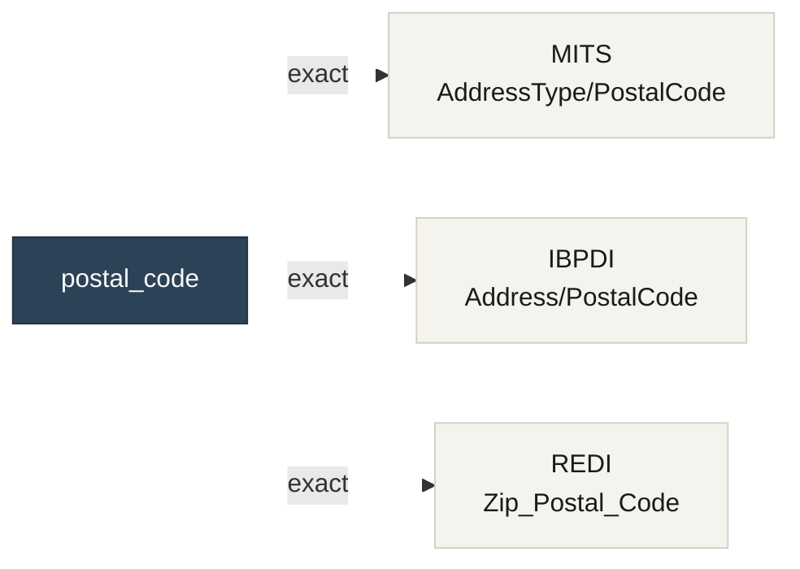

# Concepts

The vocabulary CORA publishes — the terms a consuming team will encounter when looking up a field, reading a crosswalk, or integrating CORA's artifacts into a pipeline. The corresponding code-side vocabulary (seams, adapters, extractor protocol) lives under [Contributing](seams.md) and is not needed to use the data.

## Canonical concept

A **canonical concept** is a single, field-level thing that recurs across real assets data — `postal_code`, `street_address`, `email_address`, `lease_end_date`. CORA names each one explicitly and maintains one record of how it appears in every participating standard.

Concept names are lowercase snake_case (`postal_code`, not `PostalCode`). Aliases are recorded so a search for `zip`, `zip_code`, `postcode`, or `postal_zip` all resolve to the same concept.

A concept is intentionally **leaf-level**. CORA crosswalks today map a single field per standard, not a whole composite type. "The address concept" is out of scope; "the postal code part of an address" is in scope. This keeps the mapping unambiguous and the confidence label honest.

## Per-standard mapping

A concept's **mapping** for one standard names the inventory path where that concept lives in that standard's schema, and how confident CORA is that the mapping is right.

```yaml
mappings:
  mits:
    field: AddressType/PostalCode
    version: '4.0'
    confidence: exact
  ibpdi:
    field: Address/PostalCode
    version: '1.0'
    confidence: exact
  redi:
    field: Zip_Postal_Code
    version: '1.0'
    confidence: exact
```

Three pieces of information for each standard: the **field path** (where the concept lives in that standard's inventory), the **version** of the standard the path is verified against, and a **confidence label**.

When a standard does not represent a concept, the mapping uses `field: null` with `confidence: not_present` and a narrative explaining the absence.

## Confidence vocabulary

Each mapping is labeled with one of five confidence values. The label is editorial; it records the maintainer's honest assessment of how well the two fields align.

| Value | Meaning |
|---|---|
| `exact` | The fields are identical in name (modulo casing), semantics, and cardinality. Same concept, same shape. |
| `close` | Same concept, minor differences in name, formatting, or optionality. Safe to use interchangeably with care. |
| `partial` | Same concept, meaningful differences in scope or definition. Check the notes before relying on equivalence. |
| `divergent` | Same word, different concept. Requires narrative notes. The mapping warns rather than enables. |
| `not_present` | The concept genuinely does not exist in this standard. Requires `field: null` and narrative notes. |

`divergent` and `not_present` always carry narrative notes explaining why. The CI gate enforces this.

## Inventory

An **inventory** is a normalized YAML view of one module of one standard — the format-agnostic substrate every crosswalk reads from. One file per module: `standards/<std>/current/inventory/<module>.yaml`. MITS has seven, IBPDI has seven, REDI has one.

The shape is consistent across standards regardless of the original source format (XSD, JSON, Excel):

```yaml
standard: mits
module: property-marketing
version: '5.0'
source_label: xsd
types:
  - name: PropertyType
    extends: Identifiable
    definition: A property listed for marketing.
fields:
  - path: PropertyType/PropertyID
    domain: PropertyType
    range: Identification
    cardinality: required
    definition: Unique identifier for the property.
```

Every committed inventory passes structural and field-count validation in CI before publication. The shape is documented in detail under [Consuming inventories](consuming-inventories.md).

## Crosswalk

A **crosswalk** is the YAML that ties one canonical concept to its per-standard mappings. One file per concept: `crosswalks/concepts/<concept>.yaml`.



The crosswalk is the unit of consumption. A pipeline that needs to unify postal codes across three sources reads one file (`crosswalks/concepts/postal_code.yaml`), follows the per-standard paths into each inventory, and produces a single column from three differently-shaped inputs.

The shape and walkthrough of a crosswalk lives under [Reading a crosswalk](reading-a-crosswalk.md).

## Coverage matrix

The **coverage matrix** is a single Markdown view of concepts × standards with confidence indicators. It answers one question quickly: *which fields are safe to rely on across the sources my organization actually receives?* A `partial` cell warns that pipeline logic needs to handle a definitional gap; a `not_present` cell warns that one source simply cannot answer that question.

The matrix regenerates on every change to any crosswalk or inventory and lives in the repository at [`docs/generated/coverage-matrix.md`](https://github.com/coradata/cora/blob/main/docs/generated/coverage-matrix.md).

## Standard, module, version

A **standard** is one of the participating industry standards CORA maintains inventories for — `mits`, `ibpdi`, `redi` today. A **module** is one logical unit within a standard, sized to a meaningful chunk of the schema (MITS Property-Marketing, IBPDI Financials). A **version** is the standard-body-assigned version label of the source artifact the inventory was extracted from.

Versions are tracked per-mapping in every crosswalk. When a standard releases a new version, CORA's drift register surfaces which mappings need re-verification.

---

Next: **[What CORA publishes](artifacts.md)** — the catalogue of inventories, crosswalks, and the coverage matrix.
