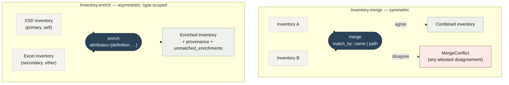

# Inventory operations: `merge` vs `enrich`

!!! note "Contributing"
    This page documents the implementation toolkit used to maintain CORA's published artifacts. Most consumers won't need it. If you're a data team integrating CORA into a pipeline, start with [Quickstart](quickstart.md) or [Consuming inventories](consuming-inventories.md).

Two named operations on the `Inventory` type. Picking the right one is a load-bearing call; the design rationale lives in [ADR-0001](https://github.com/coradata/cora/blob/main/docs/adr/0001-enrich-vs-merge.md).



## The distinction in one paragraph

`merge` is **symmetric**: two inventories of equal authority, combined into one. Any attested disagreement is a real problem, and the operation raises `MergeConflict` to surface it. `enrich` is **asymmetric**: a primary inventory (`self`) gets filled in by a *secondary* source (`other`) for a specific set of attributes the caller trusts. Disagreements outside that trust list are silently dropped from the top level but recorded in `provenance` for review. The operation never raises.

| | `merge` | `enrich` |
|---|---|---|
| Caller's relationship to the data | Two equal halves of one source | One primary, one fill-in |
| Match key | Caller picks `'name'` or `'path'` | Hardcoded: `(field.domain, leaf-name)` |
| Trust filter | None (all attributes flow) | Required `attributes: set[str]` |
| Disagreement behavior | `raise MergeConflict` | Silently picks per trust list; records provenance |
| Unmatched `other.fields` | Appended to result | Recorded in `unmatched_enrichments[]` |
| When to use | Combining XSD-domain + XSD-extends views | XSD enriched by Excel; future: PDF, SQL DDL |

## Why two methods and not parameters

A single `merge(other, *, strict, attributes, ...)` would do both jobs, but the interface would lie about what it does. A reader seeing `inv.enrich(other, attributes={"definition"})` knows immediately this is asymmetric and won't raise. A reader seeing `inv.merge(other, match_by="name", attributes={"definition"}, append_unmatched=False)` has to study the parameters to understand the semantics.

The deletion test: if `enrich` didn't exist, every enrichment-source caller (Excel today, PDF tomorrow, SQL DDL after that) would have to compose `merge` with the same pre-filter logic. Adding `enrich` concentrates that pattern in one place. See [ADR-0001](https://github.com/coradata/cora/blob/main/docs/adr/0001-enrich-vs-merge.md) for the eight sub-decisions that constrain `enrich`'s shape.

## The Phase 3c MITS flow

```python
from cora_extractors.inventory import Inventory

xsd_inv = Inventory.from_yaml("standards/mits/current/inventory/lead-management.yaml")
excel_inv = Inventory.from_yaml("/tmp/lead-management-excel.yaml")

enriched = xsd_inv.enrich(excel_inv, attributes={"definition", "enumeration"})
enriched.to_yaml("standards/mits/current/inventory/lead-management.yaml")
```

The trust list `{"definition", "enumeration"}` says: take Excel's prose definitions and Excel's enumeration lists, but ignore Excel's claims about `range` (Excel's `range="Complex"` would otherwise overwrite XSD's `range="AddressType"`).

Same thing via the CLI:

```bash
tools/extractors/.venv/bin/cora inventory merge \
  --into standards/mits/current/inventory/lead-management.yaml \
  --from /tmp/lead-management-excel.yaml \
  --attribute definition --attribute enumeration \
  --output standards/mits/current/inventory/lead-management.yaml
```

## Reading provenance

When `enrich` finds ≥2 sources attested for an attribute, the merged inventory carries the full lineage:

```yaml
- path: EventType/Description
  domain: EventType
  definition: "An event recorded in the lead lifecycle."
  source_location: lead-management.xsd:146
  provenance:
    - attribute: definition
      claims:
        - source: xsd
          value: "EventType"
          location: lead-management.xsd:146
        - source: excel
          value: "An event recorded in the lead lifecycle."
          location: lead-management.xls!Lead Management 4.0!23
      chosen: excel
```

**`claims[]`** lists every source that attested. Always ≥2 entries (single-source attestations don't get provenance — the top-level value carries them implicitly).

**`chosen`** is present only when claims disagree. When all claims agree, the field is omitted — there was no decision to record.

**Untrusted disagreements are still recorded.** If Excel says `range="Complex"` and XSD says `range="AddressType"`, the top-level `range` stays as XSD's (because `range` isn't in the trust list), but a provenance entry is written so the YAML diff between regenerations shows that Excel changed its claim. Future PDF or SQL DDL enrichment adds more `claims` entries to the same field.

## Reading `unmatched_enrichments`

Top-level on the `Inventory`:

```yaml
unmatched_enrichments:
  - source: excel
    domain: PersonType
    field: IDValue
    location: lead-management.xls!Person Type!7
```

These are `other.fields` rows whose `(domain, leaf-name)` found no match in `self`. In MITS, most unmatched rows reflect the docs-vs-defs mismatch: Excel documents fields by usage context (`Person Type` sheet listing IDValue), XSD models them by definition (IDValue lives on `Identification`). The audit catches typos and sheet-mapping errors without polluting `fields[]`.

## Auditing what a merge changed

The repo ships a script that spotlights multi-source disagreements:

```bash
tools/extractors/.venv/bin/python tools/extractors/scripts/show_disagreements.py \
  standards/mits/current/inventory/accounts-payable.yaml \
  --attribute definition
```

```
mits/accounts-payable — 124 fields total
  source_label: xsd
  disagreements: 4

  [definition] InvoiceDetailType/FreightAmount  (chosen: excel)
      xsd: 'Freight amount for each line item'
    * excel: 'Per line item freight amount'
  ...
```

Useful for spot-checking before merging a re-extraction PR.

---

Next: **[CLI reference](cli-reference.md)** — every `cora` subcommand.
