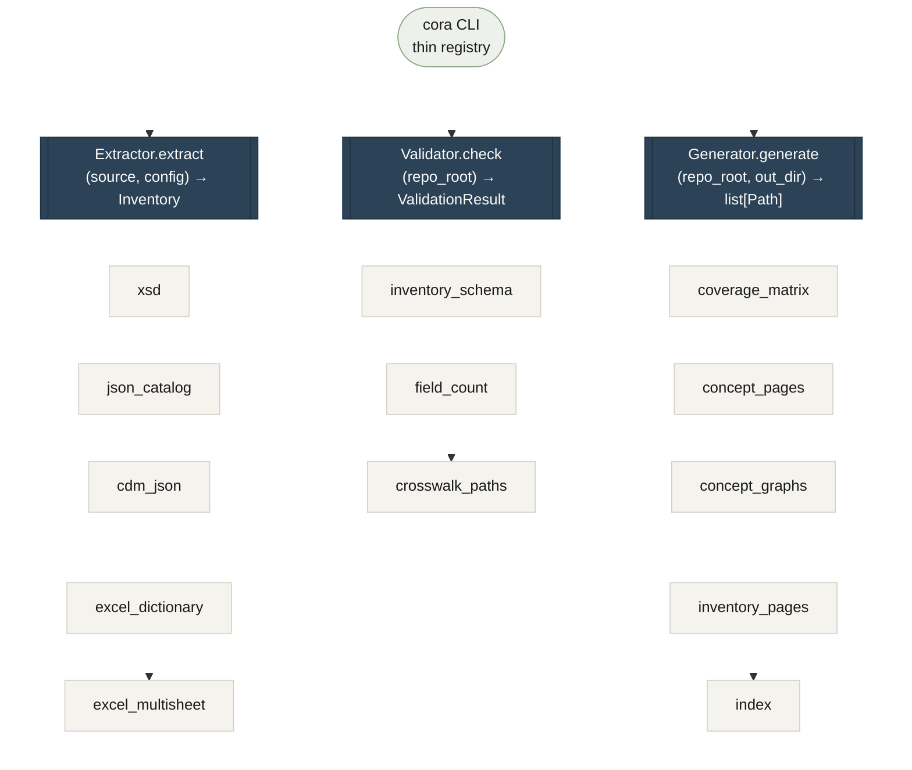

# How CORA's seams work

!!! note "Contributing"
    This page documents the implementation toolkit used to maintain CORA's published artifacts. Most consumers won't need it. If you're a data team integrating CORA into a pipeline, start with [Quickstart](quickstart.md) or [Consuming inventories](consuming-inventories.md).

A **seam** is where a protocol lives — the named interface that adapters conform to. CORA has three. The CLI is a thin registry over them; each adapter is one file. Adding a new format or a new validator or a new docs page type is *one new adapter at the existing seam*, not a new code path through the CLI.



## The three protocols

### Extractor

```python
@runtime_checkable
class Extractor(Protocol):
    name: str
    def extract(
        self,
        source: Path,
        config: ExtractorConfig | None = None,
        *,
        module: str | None = None,
    ) -> Inventory: ...
```

Lives at [`cora_extractors.extractor`](https://github.com/coradata/cora/blob/main/tools/extractors/src/cora_extractors/extractor.py).

Five adapters today:

| Adapter | Reads | Config |
|---|---|---|
| `xsd` | XML Schema files (resolves `xs:include` chains) | `XsdConfig` (optional remap dict for unresolvable URLs) |
| `json_catalog` | Flat JSON catalogs (JSONPath-described) | `JsonCatalogConfig` (required — describes the shape) |
| `cdm_json` | Microsoft Common Data Model JSON manifests | `CdmJsonConfig` (optional — inheritance root marker) |
| `excel_dictionary` | Single-sheet Excel data dictionaries (REDI shape) | `ExcelDictionaryConfig` (required — column mapping) |
| `excel_multisheet` | MITS multi-sheet workbooks (one sheet per type) | `ExcelMultiSheetDictionaryConfig` (required — sheet→type mapping) |

Every adapter sets `Inventory.source_label` at construction time (`"xsd"`, `"excel"`, `"cdm-json"`, …) so the same data wears the same label everywhere it appears.

### Validator

```python
@runtime_checkable
class Validator(Protocol):
    name: str
    def check(self, repo_root: Path) -> ValidationResult: ...
```

Lives at [`cora_extractors.validator`](https://github.com/coradata/cora/blob/main/tools/extractors/src/cora_extractors/validator.py).

Three adapters today:

| Adapter | Checks |
|---|---|
| `inventory_schema` | Every committed inventory validates against the JSON Schema and passes structural invariants. |
| `field_count` | Every inventory clears its per-module minimum field count (catches silently empty extractions). |
| `crosswalk_paths` | Every crosswalk's `mappings.<std>.field` resolves against the standard's inventories; `not_present` requires `field: null` + `notes`; `divergent` requires `notes`. |

`cora validate` runs all three; `cora validate <name>` runs one.

### Generator

```python
@runtime_checkable
class Generator(Protocol):
    name: str
    def generate(self, repo_root: Path, output_dir: Path) -> list[Path]: ...
```

Lives at [`cora_extractors.generator`](https://github.com/coradata/cora/blob/main/tools/extractors/src/cora_extractors/generator.py).

Five adapters today:

| Adapter | Output |
|---|---|
| `coverage_matrix` | One Markdown table: concepts × standards with confidence badges. |
| `concept_pages` | One Markdown per crosswalk: mappings table + per-concept Mermaid graph. |
| `concept_graphs` | One overview Mermaid flowchart of every concept and its mappings. |
| `inventory_pages` | One Markdown per inventory: types table + fields table sorted by path. |
| `index` | `docs/generated/README.md` linking everything with per-standard counts. |

`cora docs build` runs every Generator in registry order; `cora docs check` regenerates into a temp directory and diffs against `docs/generated/` (the CI drift gate).

## The adapter pattern, end to end

Concretely, registering a new adapter is four edits:

1. **Write the adapter** — one file under `cora_extractors/{format}.py` (Extractor), `cora_extractors/validators/{name}.py` (Validator), or `cora_extractors/generators/{name}.py` (Generator). Implement the protocol's method.
2. **Add a config class** if needed — a `pydantic` subclass of `ExtractorConfig` in `cora_extractors/config.py`. Extractor only.
3. **Register in the CLI** — add the adapter to the appropriate dict/list in `cora_extractors/cli.py`. One line.
4. **Add tests + a fixture** — at least one positive round-trip test under `tools/extractors/tests/`. Two fixture sources where reasonable (the "two-source genericity audit" — see [Onboarding a format](onboarding-a-format.md)).

The CLI dispatches by name; new adapters show up automatically. There's no central switch statement to update.

## Why three seams and not one

Earlier drafts of the toolkit had a single "process this artifact" entry point. It conflated three different jobs with different signatures: extract reads, validate checks, generate writes. Naming them separately lets each one have an honest interface — and lets `cora validate` run all three of its adapters in parallel without confusing them with extractors.

The discipline that keeps the design clean: **two adapters at a seam means the seam is real; one adapter is just a hypothesis.** Each seam crossed three before being stabilized.

---

Next: **[merge vs enrich](inventory-operations.md)** — the two named operations on Inventory and why they're separate methods.
